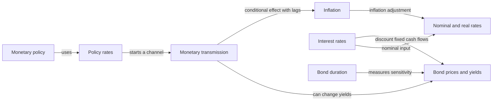

---
tags:
  - node/theme
---

# Interest Rates, Inflation and Bonds

This first relationship cluster connects eight existing concepts. Each concept contains a definition, an example or interpretation guide, and sourced relationship statements with their conditions. These are educational explanations, not a forecast of current market prices.

## Read in order

1. [[Concepts/Economics/Monetary Economics/Interest and Interest Rates|Interest and Interest Rates]]
2. [[Concepts/Economics/Monetary Economics/Nominal and Real Interest Rates|Nominal and Real Interest Rates]]
3. [[Concepts/Economics/Macroeconomics/Inflation|Inflation]]
4. [[Concepts/Finance/Central Banking/Monetary Policy|Monetary Policy]]
5. [[Concepts/Finance/Central Banking/Policy Interest Rates|Policy Interest Rates]]
6. [[Concepts/Finance/Central Banking/Monetary Transmission|Monetary Transmission]]
7. [[Concepts/Finance/Markets and Instruments/Bond Prices and Yields|Bond Prices and Yields]]
8. [[Concepts/Finance/Investing and Portfolios/Bond Duration|Bond Duration]]

## Mechanism sketch

This sketch selects relationships for reading. Edge labels matter: an instrument, a measurement and a causal channel are different relations. The concept pages contain the supporting sources and limitations.

## Reading the original videos

The bond-price and real-rate pages link to two local transcripts as examples of how the concepts are used. Speaker reports, interpretations and forecasts are identified separately from the sourced definitions. No transcript text was changed.

## How to extend this cluster

Add a relationship only when its meaning, conditions and source can be stated. Co-occurrence in a video is a discovery clue, not proof of a causal connection. Do not duplicate or invent edges to equalize node degrees.

Open [[Topics/Graph Views|Graph Views]] for concept and source-network filters. Return to [[Topics/Index|Knowledge Map]].
