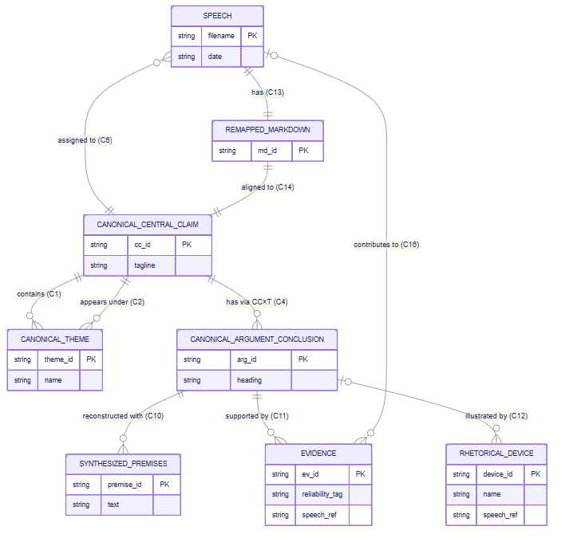

# PrologPromptArchitecture

原文件：[打开原稿](<../../../../materials/APS1053/06_Research_Drafts/PrologPromptArchitecture.docx>)

自动整理的阅读副本，保留作者内容，不代表已校正其论证或技术主张。原稿是版式依据。

# 

Claude: This paper is based on 4 sources:

prompt_reorganized.md

**prompt_prolog_version.txt**

compendium_StructuralDescription_relationshiptypes.txt

deepseek_speech_processing_program1_notree_revised2.py

Link here: [DeepSeek_revised2_by_chatgpt.rar](https://github.com/Xinze-Li-Moqian/FinAI/tree/main/materials/APS1053/07_Prompt_Pipeline/DeepSeek_revised2_by_chatgpt

# The Architecture of a Prompt: A Prolog-Inspired Alternative to Prompt Anatomy

## The problem with prompt "anatomy"

Most current guidance on structuring prompts — Prompt Engineering in Practice MEAP by -- Richard Davies, Rafael Fischer -- describe a prompt as six parts: **Task/Instruction, Constraints, Context, Input Parameters, Output Format, Delimiters**. Promptenza adds Role and Examples.

1\. Instructions/Task: Clear and concise instructions that define the task for the language model.

2\. Constraints: Falsifiable conditions that define what the output must not

violate, independent of how the task is defined or what shape it takes.

3\. Context: Background information and setting necessary for accurate and

relevant responses.

4\. Input Parameters: Variables for input data replaced with concrete values before inference to inject dynamic context at runtime.

5\. Output Format: Specifying the desired structure and style of the generated content.

6\. Delimiters: Boundary markers around contextual content that help the

model distinguish instructions from embedded text.

7\. Role: perspective, function, or type of expertise it should use when approaching the task

8: Examples: what the desired result should look like.

https://www.manning.com/preview/prompt-engineering-in-practice/chapter-https://promptenza.com/prompt-anatomy/

This is a useful checklist, but it is organized primarily by *rhetorical function*: it groups prompt content by the kind of sentence being written, rather than by what that content does within the reasoning system.

The result is that two very different kinds of information can end up living side by side under the same heading. "Instructions" can mix a task definition with procedural guidance and a prohibition. "Context" can mix raw facts with the vocabulary and structure (settings) needed to interpret them. Finally, nothing in the anatomy itself requires the designer to distinguish which parts specify *the domain being reasoned about* from which parts specify *how the reasoning system is permitted to operate*.

For simple prompts, this anatomy is useful. For complex prompts, however, it can become a checklist without an underlying architecture.

Prolog — not as syntax to paste into a prompt, but as a conceptual model — suggests a way to make that architecture explicit. This article proposes supplementing prompt anatomy with a **Prolog-inspired prompt architecture**: a separation between the specification of the problem/domain and the specification governing the reasoning process, with each side decomposed according to a different logical function.

The proposal is therefore not that prompts should be written as Prolog programs. It is that Prolog provides a useful design discipline.

## The prompt this article discusses

The Prolog-inspired architecture proposed here is not developed in the abstract. It is illustrated throughout by an actual complex prompt: the specification behind a Python program — a five-phase "map-reduce-summarisation" pipeline — that:

- processes a folder of single-speaker finance, economics, and investment speech transcripts into a structured, provenance-preserving **compendium** — a synthesis organized by claim and theme rather than by individual speech — plus a companion structured list of claims flagged as unverifiable from the transcript text alone;

- uses a Large Language Model as a financial speech-analysis assistant across five dependent phases, **Summarize → Inventory → Consolidate → Remap → Assemble**, in which each phase consumes only what an earlier phase has already produced and validated;

- is required to produce output rich enough to preserve the intellectual structure, evidence, analogies, rhetorical devices, recurring claims, and temporal evolution of a large transcript corpus, rather than collapsing it into a shallow, homogenized summary.

Briefly, the five phases are:

1.  **Summarise** extracts each transcript's own local central claim, themes, arguments, premises, evidence, analogies, and unverifiable claims, in the speech's own words, with no canonicalisation yet.

2.  **Inventory** aggregates every extraction into one corpus-wide manifest without merging or reinterpreting anything.

3.  **Consolidate** is where the LLM does its heaviest judgment work: discovering canonical Central Claims (CCs) and canonical Themes by clustering the local claims and themes, then classifying each speech into its single best-argumentative-home CC plus up to three canonical Themes, under a closed vocabulary of relationship types (supports, opposition, qualification, and others).

4.  **Remap** is deliberately non-authorial: Python attaches canonical mappings and per-argument source-contribution records onto each Phase 1 extraction, without asking the LLM to rewrite or re-decide anything.

5.  **Assemble** groups the validated contributions into per-CC-per-Theme "buckets" and asks the LLM to synthesize prose *within one bucket at a time*, forbidden from turning a qualification or an opposition into affirmative support, inventing a consensus, or moving material across pairs.

This is exactly the kind of prompt for which a rhetorical, six-part anatomy (Role, Task, Context, Constraints, Examples, Output Format) starts to strain: the specification must simultaneously describe a corpus-scale domain model (claims, themes, their many-to-many relationship, a closed relationship-type vocabulary), allocate authority between the LLM and the surrounding Python program across five dependent phases, and guarantee — mechanically, not just by instruction — that nothing synthesized in a later phase silently overrides a judgment already made in an earlier one. The project's own working documents, in fact, already state its governing requirements twice: once as ordinary prose (prompt_reorganized.md) and once in a deliberately Prolog-inspired notation (prompt_prolog_version.txt), precisely in order to test whether the two levels — object and meta — could be told apart. The remainder of this article uses that dual statement as its running example.

## Why start from the Prolog/prompt analogy at all

That Prolog-inspired notation did not appear from nowhere. It follows an earlier, more basic observation: that writing a prompt and writing a Prolog program are both fundamentally *declarative* acts. Neither specifies a procedure; both describe a world and then pose a question against it, leaving the underlying engine to work out how to answer.

### The core correspondence

Below we show the correspondence between a Prolog program and a Prompt as a single diagram, pairing each Prolog construct with its prompting counterpart and closing with the principle both sides share:

| Prolog | Prompting Claude |
|----|----|
| **Declarative paradigm** — describe what, not how | **Declarative prompting** — specify the goal, not the steps |
| **Facts** — ground truths in the knowledge base | **Context, constraints** —description of the object domain : entities, entity properties and relations, cardinalities, base cases, object domain limits |
| **Rules (Horn clauses)** — if conditions hold, conclusion follows | **Instructions & format rules** — if X, then respond with Y |
| **Query** — the goal to satisfy | **The user's question** — what you actually ask Claude |
| **Inference engine** — searches for a proof automatically | **Claude's reasoning** — finds a path to the answer |

> Both separate the specification of a problem from the mechanism that solves it.

### A worked example: the family tree

Let us ground the correspondence in the standard Prolog teaching example — a family tree — because it is short enough to show facts, rules, and a query together in nine lines:

parent(tom, bob).

parent(bob, ann).

ancestor(X, Y) :- parent(X, Y).

ancestor(X, Y) :- parent(X, Z), ancestor(Z, Y).

?- ancestor(tom, ann).

true.

That is facts, rules, and a query in nine lines — structurally identical to a system prompt establishing context, instructions defining derived behavior, and a user question.

### Facts, rules, and the query, built up side by side

**Facts.** In Prolog, facts are ground truths — statements unconditionally true in the knowledge base. In a prompt, facts are the context: background information Claude is expected to treat as true for the conversation. Same information; one is formal syntax, the other natural language.

<table>
<colgroup>
<col style="width: 50%" />
<col style="width: 50%" />
</colgroup>
<thead>
<tr>
<th>Prolog</th>
<th>Prompt</th>
</tr>
</thead>
<tbody>
<tr>
<td>
parent(tom, bob).

parent(bob, ann).

speaks(ann, french).

speaks(bob, english).
</td>
<td>
Ann is a French speaker.

Bob is an English speaker.

Bob is Ann's parent.

Tom is Bob's parent.
</td>
</tr>
</tbody>
</table>

**Rules.** In Prolog, rules derive new facts from existing ones; :- means "if." In a prompt, rules are the instructions: conditional behavior Claude is asked to follow. The logical structure is identical; the prompt version is fuzzier — Claude applies the rule approximately, handling cases the author didn't anticipate — but the intent is the same.

<table>
<colgroup>
<col style="width: 50%" />
<col style="width: 50%" />
</colgroup>
<thead>
<tr>
<th>Prolog</th>
<th>Prompt</th>
</tr>
</thead>
<tbody>
<tr>
<td>
ancestor(X, Y) :- parent(X, Y).

ancestor(X, Y) :- parent(X, Z), ancestor(Z, Y).

bilingual_family(X) :- parent(X, Y),

speaks(X, english), speaks(Y, french).
</td>
<td>
If the user asks about family relationships, trace them

step by step from the facts given above.

If a parent and child speak different languages, note

that the family is bilingual.
</td>
</tr>
</tbody>
</table>

**Query.** In Prolog, the query is the question put to the system once the knowledge base is loaded. In a prompt, the query is simply the user's question — the last thing asked, after context and instructions.

<table>
<colgroup>
<col style="width: 50%" />
<col style="width: 50%" />
</colgroup>
<thead>
<tr>
<th>Prolog</th>
<th>Prompt</th>
</tr>
</thead>
<tbody>
<tr>
<td>
?- ancestor(tom, ann).

true.

?- bilingual_family(bob).

true.
</td>
<td>
Is Tom an ancestor of Ann?

Is Bob's family bilingual?
</td>
</tr>
</tbody>
</table>

**Putting it together.** A complete Prolog program and its prompt equivalent, side by side:

<table>
<colgroup>
<col style="width: 50%" />
<col style="width: 50%" />
</colgroup>
<thead>
<tr>
<th>Prolog</th>
<th>Prompt</th>
</tr>
</thead>
<tbody>
<tr>
<td>
% Facts

parent(tom, bob).

parent(bob, ann).

speaks(ann, french).

speaks(bob, english).

% Rules

ancestor(X, Y) :- parent(X, Y).

ancestor(X, Y) :- parent(X, Z), ancestor(Z, Y).

bilingual_family(X) :- parent(X, Y),

speaks(X, english), speaks(Y, french).

% Query

?- ancestor(tom, ann).
</td>
<td>
Context:

Tom is Bob's parent. Bob is Ann's parent.

Ann speaks French. Bob speaks English.

Instructions:

- To determine if someone is an ancestor, trace parent

relationships step by step.

- If a parent and child speak different languages,

the family is bilingual.

Question:

Is Tom an ancestor of Ann?
</td>
</tr>
</tbody>
</table>

## Two principal levels, plus boundary constructs

The above Prolog example is very simple, but a complex prompt such as the one required by the "map-reduce-summarisation" pipeline should contain two principal kinds of specification:

| Level | Question it answers | Example |
|----|----|----|
| **Object/Domain level** | What is being reasoned about, and what follows within that domain? | "A Claim can belong to multiple Themes." |
| **Meta/Process level** | How must the reasoning system operate and communicate? | "Return the result as JSON. Do not invent new Themes." |

Prolog is helpful in the discussion of the separation in two levels because at least one Prolog construct is exclusively about the Meta level: Directives. set_prolog_flag(unknown, fail) is a process level construct: it is a default-compiler-setting directive (not a domain fact/rule) that governs what happens when you query a relation the facts don't cover (e.g., speaks(tom, X) when Tom's language was never stated), fitting alongside the existing ancestor/parent/speaks predicates:

| Prolog | Prompt |
|----|----|
| :- set_prolog_flag(unknown, fail). | By default (a compiler setting, not a family-tree fact), if a relationship such as someone's nationality is never stated among the facts, treat the query as false rather than raising an "unknown predicate" error. |

If a Prolog programmer seeks to obey the distinction between Object Domain and Meta/Process levels, s/he can do so by restricting all object-related Facts and Rules to the Object/Domain level and by expressing all process-related Facts and Rules as Directives, to keep everything tidy. For example, Facts are usually focused on the Object level, but Facts can establish process parameter/configuration settings at the Meta level. E.g. verbosity(low) is a Fact. The same effect can be obtained with the more explicit directive :- assertz(verbosity(low). Process flow control can be effected using a Rule: run_pipeline :- summarise, inventory, consolidate, remap, assemble, which has rule syntax (Head :- Body) but zero domain content. But the same process control can be done more explicitly with the directive :- summarise, inventory, consolidate, remap, assemble. So in Prolog, the distinction between Object/Domain vs Meta/Process can be kept naturally.

Prolog constructs do not map one-to-one onto the conventional prompt components, but the mapping below nonetheless helps one understand how the conventional prompt components scatter across the Object and Meta levels:

| Prompt component | Closest Prolog-inspired analogue | Level | Why |
|----|----|----|----|
| **Role** | Directive / meta specification | Meta | Establishes the perspective or function the model is to adopt; it is not itself a domain fact |
| **Task** | Query | Boundary | States what the system is being asked to determine or produce |
| **Instruction** | Rules and/or directives, depending on content | Object + Meta | An instruction may specify an operation, an inference procedure, or a process requirement |
| **Context** | Terms, predicates, facts, relationships, vocabulary | Object + Meta | Supplies the domain model and knowledge over which the task operates; includes configuration settings |
| **Constraints** | Domain, process, or output constraints; potentially encoded as validation predicates/rules | Object + Meta | A prompt constraint is a requirement on validity, not a Prolog syntactic category; a Prolog rule can encode a check for that requirement |
| **Examples** | Base cases, example facts, queries, and expected answers; no direct equivalent in Prolog for most cases. | Object + Meta | Base/degenerate Cases (terminating condition). Demonstrate desired input→output behavior; few-shot demonstration is an LLM-specific mechanism |
| **Output Format** | Directive / meta-level specification | Meta | Specifies how the result is represented rather than what the result means |

In the current guidance for prompts of Davies and Fisher, the **Constraint** category is limited to output constraints: “constraints are falsifiable conditions that define what the output must not violate, independent of what the task is or what form the response takes.” (see: <https://livebook.manning.com/book/prompt-engineering-in-practice/chapter-2/v-5?utm_source=chatgpt.com> ). This means object domain constraints need to live in **Context,** and process constraints need to live in **Instructions**. Indeed, these authors put **Instructions and Task** into a single **Instructions/Task** container for a miscellaneous list: prohibitions (process constraints), procedural guidance/pseudocode, system-level requirements, configuration settings and task description all live there. **Context** contains object domain information and meta information (parameter/configuration settings).

In our view, the above guidance for prompts lumps too many items into a single containers and prevents us from making important distinctions. So in the below mapping for a COMPLEX PROMPT, we flesh out the distinction between Object and Meta/Process level using Prolog constructs as helpful place holders:

COMPLEX PROMPT

│

┌─────────────┴─────────────┐

│ │

OBJECT LEVEL META / PROCESS LEVEL

"What?" "How?"

│ │

Domain Model Role

│ \|

Context: Directives/Instructions:

Terms / Predicates Process Constraints

Facts / Relationships Output Constraints

Cardinalities Output Format

Vocabulary Process Configuration Parameters

Rules \|

Object Constraints \|

Base Cases \|

│ │

└─────────────┬─────────────┘

│

QUERY/Task

│

▼

CONTROLLED EXECUTION

│

▼

OUTPUT

This mapping is deliberately **conceptual rather than syntactic**. In particular, a "Directive" in the proposed prompt architecture is Prolog-inspired; it does not mean that every such directive is a legal ordinary-Prolog directive. This is a design discipline applied before the final natural-language prompt is written.

An advantage of the above COMPLEX PROMPT mapping that one can easily see from the mapping that the elements in Context can be organized into an attributed or constrained Entity-Relationship (ER) diagram. Such a diagram defines entities and their attributes, entity relationships, cardinalities, junction tables, rich structural constraints, semantics, and properties beyond basic cardinality (such as participation constraints, degree, or descriptive relationship attributes). This matters because our "map-reduce-summarisation" pipeline contains many-to-many relationships whose materialization is itself part of the application design as shown below. The architecture should therefore make those relationships explicit rather than leaving them implicit in prose. Below we show a partial Entity-Relationship diagram with a controlled vocabulary section for the object domain of the phase "map-reduce-summarisation" pipeline (inspired in compendium_StructuralDescription_relationshiptypes.txt):

Every categorised speech must have exactly one controlled primary relationship type and a non-empty relationship explanation. The controlled vocabulary is:

– supports

The speech directly argues that the Canonical Central Claim is true.

– specific_instance

The speech presents a narrower, concrete, or more specific instance of the

broader Canonical Central Claim.

– mechanism

The speech explains a process through which the Canonical Central Claim

operates or could become true.

– consequence

The speech explains a result, implication, or downstream effect of the

Canonical Central Claim.

– qualification

The speech limits, conditions, refines, or adds an exception to the

Canonical Central Claim.

– opposition

The speech challenges, disputes, or presents contrary evidence against the

Canonical Central Claim.

– historical_example

The speech supplies a historical illustration, analogy, or precedent that

bears on the Canonical Central Claim.

– application

The speech applies the Canonical Central Claim to a specific policy, market,

institution, country, period, or event.

– evidence

The speech mainly supplies empirical or illustrative evidence relevant to

the Canonical Central Claim rather than independently restating its full

thesis.

Another way in which the COMPLEX PROMPT mapping becomes evident if one needs to write complex prompts that encode and require validation for the Principle of Least Agency. Our objective in writing the prompt (prompt_organized.md) is to ask the programmer LLM (Claude) to write a Python program for a "map-reduce-summarisation" pipeline that coverts hundreds of video transcripts into a book in .md file format. The "map-reduce-summarisation" pipeline we require divides the work into two parts: the semantic reasoning part is performed by a text-analyzer LLM (DeepSeek), the rest of the work is carried out by the Python program. To implement Least Agency, our prompt must place a verifiable process constraint on the program that the programmer LLM (Claude) is writing: a process constraint that prevents the programmer LLM (Claude) from assigning to the text-analyzer LLM (DeepSeek) tasks that a Python program is capable of doing instead, like verify prompt requirements deterministically. The process constraint is in the Meta/Process side of the COMPLEX PROMPT mapping, under directives, and it is separate from the Query/Task.

A simplified version of the Principle of Least Agency directive in prompt_reorganized.md is the following:

Principle of Least Agency: The program must be designed to minimise unnecessary LLM discretion and maximise deterministic execution. Specifically, one component specification of Least Agency is: All LLM output is a proposal, not a result: Python validates it against explicit constraints before acceptance, and rejects or flags output that fails. The following diagram is meant to illustrate this piece of the specification:

TASK

│

┌─────────────┴─────────────┐

↓ ↓

MODEL PROGRAM

│ │

semantic judgment deterministic validation

/ proposal & bookkeeping

│ │

└─────────────┬─────────────┘

↓

ACCEPTED RESULT

Clearly, Least Agency is a meta/process directive, not a fact about the object domain. But Least Agency is not an output constraint either (an output constraint independent from process as described in the current guidance for prompts). It is instead an entire process constraint. Why? One way Least Agency is implemented (in prompt_organized.md and deepseek_speech_processing_program1_notree_revised2.py) is that Python validates the LLM (DeepSeek)’s semantic judgement proposals by creating the integrity_report.json, and it creates this file after performing a cross-phase audit that checks that the outputs of Phase 3 (CONSOLIDATE), 4 (REMAP) and 5 (ASSEMBLE) are all consistent with compendium_StructuralDescription_relationshiptypes.txt’s Table A of the Entity-Relationship Schema (defining the canonical entity relationships, cardinalities and closed vocabulary) which Python has materialized with persistent artifacts.

So the COMPLEX PROMPT mapping we propose above is a helpful thinking tool, because it makes explicit all the elements that are present in the implementation of Least Agency, at least for this one piece of it. The Prolog-inspired division into Object Domain vs Meta/Process directives made us recognize the importance of both domains. It made us analyze the Object Domain deeply by itself, organizing it with an Entity-Relationship schema. The Entity-Relationship schema is what Python uses to verify the Least Agency principle deterministically, so it turned out to be central to the implementation. The mapping also separates the Task from the Instructions, and made us analyze the Meta/Process level deeply as well, helping us focus on process constraints for the division of labor between the LLM (DeepSeek) and Python.

## Conclusion

The conventional prompt anatomy works well for simple prompts. But the map-reduce-summarisation pipeline shows its limits for complex systems. Here, the prompt must describe a many-to-many domain model, a closed vocabulary, and the division of work between an LLM and Python across several dependent phases. In such a system, “Context” and “Instructions” become too broad to show how the parts fit together.

The Prolog-inspired approach adds a useful distinction: Object/Domain versus Meta/Process. The Object level describes the entities, relationships, facts, rules, and constraints of the domain. The Meta/Process level describes how the system should operate, including decision authority and Least Agency.

The Least Agency example shows why this distinction matters. Saying that “Python validates the LLM’s output” is not enough. Python needs explicit rules for what counts as valid. In this project, those rules are grounded in the Entity-Relationship schema, including the canonical entities, their relationships, cardinalities, and the persistent CC × Theme junction table. Python can then validate the LLM’s proposals and ensure that downstream phases use the accepted relationships rather than re-deriving them.

The main lesson is simple: a complex prompt is not just a longer simple prompt. It is a specification for a system. Conventional prompt anatomy tells us which components to include; the Prolog-inspired object/meta distinction helps organize those components so that their meaning, responsibilities, and checks are explicit.
