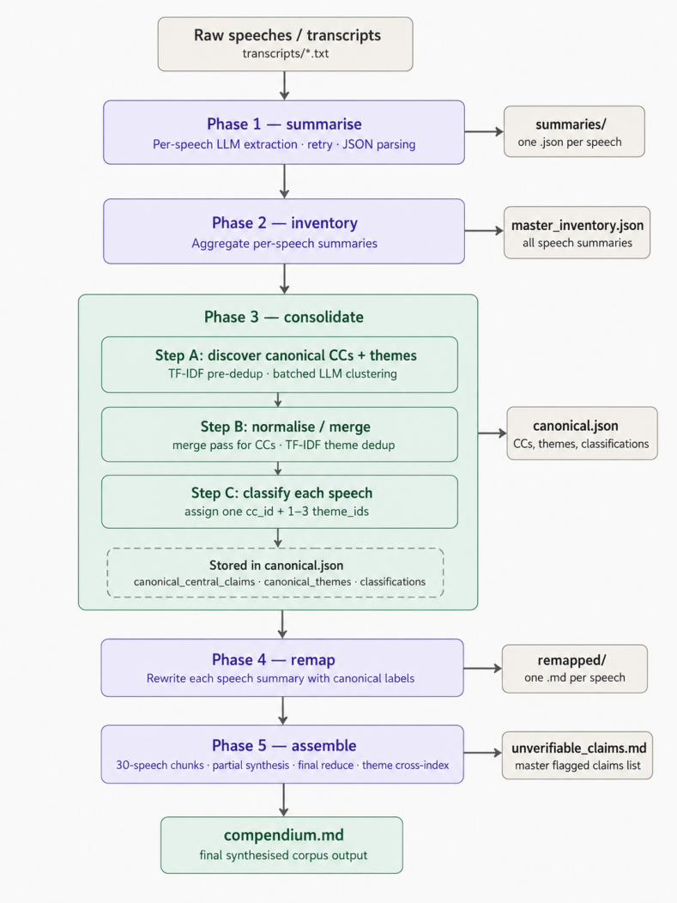
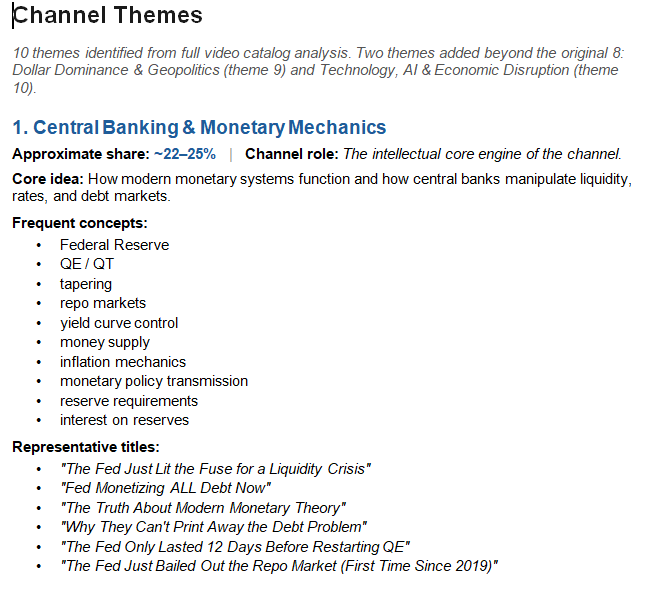

# ProgrammableLLM_With_Prompt_(MAIN)

Original file: [Open source document](<../../../../materials/02_Cases_and_Presentations/ProgrammableLLM_With_Prompt_%28MAIN%29.pptx>)

Automatically prepared reading copy preserving the author’s content. Arguments and technical claims have not been validated. Refer to the original for layout.

> Text and embedded images are extracted by slide number. Shape positions, connectors, animations, and some charts are not reconstructed; consult the original PowerPoint for diagrams.

## Slide 1

Preface

Why the deck begins with interaction styles before the pipeline

Main idea: an LLM can be used either as a chat partner for one task, or as a component inside a program that repeats the task many times.

This preface explains why the second use is necessary for a large YouTube transcript project.

1

Speaker notes:

This preface introduces the reason for distinguishing ordinary chat from program-mediated LLM use. A single chat is useful, but a large transcript corpus requires repetition, consistency, and saved intermediate files.

## Slide 2

Preface

Programmable LLM Agent applied to Crypto Channels

Two ways to interact with an LLM

The same model can be used manually or through a program.

Direct chat

• You ask one question.

• The model answers once.

• You read or copy the result.

Program-mediated use

• Program P sends many prompts.

• The model answers repeatedly.

• The program saves each output.

Best for one transcript or one quick question.

Best for thousands of transcripts and repeatable processing.

The rest of the deck is mainly about the second mode.

2

Speaker notes:

The key distinction is manual interaction versus program-mediated interaction. The same LLM can answer a one-off question, or it can be called repeatedly by a program that supplies instructions and saves outputs.

## Slide 3

Preface

Programmable LLM Agent applied to Crypto Channels

Direct interaction: one transcript at a time

This is the ordinary chat workflow.

1

Paste or attach

Give the LLM one transcript.

2

Ask the question

Example: “Summarize this transcript.”

3

Read the answer

Use the answer manually.

Useful for

• Quick prompt testing

• Small demonstrations

• Human inspection of one file

Not enough for

• Thousands of transcripts

• Consistent output format

• Automatic checkpoint files

Direct chat is useful for designing the prompt, but it is not the right execution system for a whole channel.

3

Speaker notes:

Direct interaction is the simplest way to test the task. It is useful for one transcript and for prompt design, but it does not scale well to a whole YouTube channel because the work is manual and difficult to standardize.

## Slide 4

Preface

Programmable LLM Agent applied to Crypto Channels

Program-mediated interaction: repeat the task reliably

A program can call the LLM many times and save each result.

transcripts/
.txt files

Program P
loads one file, adds the prompt, sends request

DeepSeek API
returns structured summary

summary_001.json
summary_002.json
…

What the program adds

• Same instructions every time

• One saved result per transcript

• Progress can resume after a failure

• Later phases can merge all summary files

This is the practical bridge from isolated summaries to compendium.md.

4

Speaker notes:

Program-mediated interaction turns the LLM into one component of a larger workflow. The program loads each transcript, sends the same structured request, receives a structured output, and saves a checkpoint for later phases.

## Slide 5

Preface

Programmable LLM Agent applied to Crypto Channels

A third role: ask an LLM to help write Program P

You may not know the code, but you can define the target precisely.

What you can specify

• Input folder

• Output files

• Definitions

• Rules and edge cases

Claude
writes Python code

What Program P does

• Calls DeepSeek

• Processes transcripts

• Creates checkpoints

• Builds final files

Therefore, the critical skill is not writing every Python line by hand. It is writing a programming prompt clear enough that Claude can produce the program.

The rest of the deck explains the desired outputs, the five-phase pipeline, and the rules that make the prompt precise.

5

Speaker notes:

The user does not need to write every line of Python by hand. The central skill is specifying the task precisely enough that Claude can write Program P, which then calls DeepSeek to process the transcript collection.

## Slide 6

Programmable LLM Agent

Applicable to Financial Channels

Clear expanded version for a reader with almost no programming background

Main idea: use the LLMA itself to turn hundreds or thousands of messy video transcripts into a structured compendium that the LLMA can efficiently search while minimizing  costs.

Output: compendium.md + unverifiable_claims.md

Speaker notes:

This deck explains a workflow for building a knowledge base from a large YouTube channel. The purpose is not to teach Python in detail. The purpose is to make the workflow understandable to someone who is comfortable with computers but not with programming.

## Slide 7

1 · Motivation

Programmable LLM Agent applied to Crypto Channels

The problem in one sentence

A YouTube channel can contain far more information than an LLM can read in one conversation.

You want to ask questions about the whole channel, but the channel is too large, too messy, and too repetitive to paste into Claude or ChatGPT (Even if Claude could take care of the whole project by itself, the task could become too expensive if we use just Claude instead of a combo of Claude & DeepSeek, as we will explain in a moment)

•

Many videos repeat the same ideas in different words.

•

Some statements are factual claims that may need checking later.

•

The goal is to compress the channel without destroying its intellectual structure.

Speaker notes:

The core difficulty is not merely storage. The difficulty is that raw transcripts are not organized knowledge. They are long, repetitive, and uneven. The program is meant to convert them into something closer to a book or research compendium.

## Slide 8

1 · Motivation

Programmable LLM Agent applied to Crypto Channels

What the system is trying to build

A structured knowledge base, not just a short summary.

Raw transcripts

Many speeches, many repeats

LLM pipeline

Sort, merge, label, synthesize

Compendium

Chapters, themes, evidence

A good compendium should let you ask: “What does this speaker repeatedly argue, what evidence is used, and how did the argument change over time?”

Speaker notes:

The compendium is the main product. It is not a simple abstract. It is more like a small book or analyst report created from the whole transcript collection.

## Slide 9

1 · Motivation

Programmable LLM Agent applied to Crypto Channels

Four obstacles

The deck begins by explaining why this is not a simple “paste transcripts into Claude” job.

1

Timeout

Long downloads can stop before finishing.

2

Context

The LLM cannot read millions of words at once.

3

Cost

Large commercial alternatives can be expensive.

4

Quality

Uncurated transcripts produce messy answers.

Speaker notes:

These four problems motivate the whole pipeline. Each problem is practical: jobs can time out, context windows are limited, paid tools can be expensive, and unorganized input can produce unreliable output.

## Slide 10

1 · Motivation

Programmable LLM Agent applied to Crypto Channels

Obstacle 1: download timeout

Getting thousands of transcripts can be too long for a single hosted LLM session.

•

A channel can have thousands of videos.

•

A hosted container may stop a long download before all transcripts are collected.

•

YouTube may slow or block requests if too many files are requested too quickly.

•

Better solution: run the download script on your own machine, where you control the time and files.

Practical lesson: use Claude or ChatGPT to write the script, but run the long download locally.

Speaker notes:

The first problem is not intelligence. It is execution time. Claude might be able to write a transcript downloader, but the actual downloading may be better done on a personal computer.

## Slide 11

1 · Motivation

Programmable LLM Agent applied to Crypto Channels

Obstacle 2: context window

An LLM has a maximum amount of text it can consider at one time.

Typical transcript

~7,000–8,000 words

Thousands of transcripts

Millions of words

Too large

for one chat

Context window = the temporary “working memory” of the LLM conversation.

The pipeline solves this by processing the corpus in pieces, then merging the results.

Speaker notes:

The context window is like a desk. You can work with only so many papers on the desk at once. The pipeline processes the papers in batches and then combines the results.

## Slide 12

1 · Motivation

Programmable LLM Agent applied to Crypto Channels

Obstacle 3: expensive alternatives

There are tools for very large corpora, but cost and control can become problems.

•

Notebook-style tools can help, but their memory limits may still be smaller than a large channel.

•

Enterprise tools can do coding, thematic analysis, and traceability, but they may be expensive.

•

Retraining or fine-tuning a model on a large corpus can also be costly.

•

The project aims for a cheaper, local-file workflow controlled by the user.

The point is not that commercial tools are bad. The point is that this workflow gives you a cheaper, inspectable alternative.

Speaker notes:

The deck does not claim that the commercial products are useless. It says that if the user already has transcripts and can run Python locally, it may be possible to create a custom alternative.

## Slide 13

1 · Motivation

Programmable LLM Agent applied to Crypto Channels

Obstacle 4: garbage in, garbage out

A model can only organize the material it receives. Messy inputs tend to produce messy outputs.

•

A raw transcript is usually unstructured speech, not a clean essay.

•

Speakers repeat, interrupt themselves, change topics, and use vague references.

•

A curated knowledge base removes duplicates, adds structure, and flags weak claims.

•

The pipeline is a curation machine: it turns raw speech into organized knowledge.

Garbage in, garbage out means: poor input structure leads to poor answers, even if the model is powerful.

Speaker notes:

This is one of the most important practical points. The purpose of the compendium is to improve the quality of the knowledge base before asking high-level questions.

## Slide 14

1 · Motivation

Programmable LLM Agent applied to Crypto Channels

What “curated” means here

The system is not just making the text shorter. It is making the text more organized.

Raw transcript

Curated compendium

Long, repetitive speech

Deduplicated claims

No clear chapter structure

Central claims and themes

Evidence mixed into the talk

Evidence listed under arguments

Unclear source strength

Verification status flags

Hard to search as a whole

Cross-indexed knowledge base

Speaker notes:

Curated means organized, deduplicated, and made easier to verify. The compendium is closer to an edited book than a pile of transcripts.

## Slide 15

2 · Desired output

Programmable LLM Agent applied to Crypto Channels

The desired output

Before explaining the program, define what the program must produce.

## Slide 16

2 · Desired output

Programmable LLM Agent applied to Crypto Channels

The final output has two files

The pipeline produces one main knowledge file and one claim-checking file.

compendium.md

The structured “book” of the channel

unverifiable_claims.md

Claims that need later checking

•

The compendium is meant to answer “What is the speaker’s model?”

•

The unverifiable-claims file is meant to answer “Which statements need checking?”

•

Together they help prevent the knowledge base from becoming a pile of untested claims.

Speaker notes:

The main file organizes the speaker’s ideas. The second file is a safety and quality-control file. It collects claims that may be plausible but were not supported strongly enough in the transcript.

## Slide 17

2 · Desired output

Programmable LLM Agent applied to Crypto Channels

What is a Markdown file?

Markdown is a plain text file that uses simple symbols to mark structure.

# Chapter title

## Section title

### Subsection title

- Bullet point

**Bold phrase**

•

A human can read it as ordinary text.

•

A computer can read its structure because the symbols are consistent.

•

That makes Markdown useful for a machine-built compendium.

A machine reads a Markdown file more reliably than it reads a visually formatted book.

Speaker notes:

Markdown is not a programming language in the usual sense. It is a simple way of making headings, lists, and bold text in plain text.

## Slide 18

2 · Desired output

Programmable LLM Agent applied to Crypto Channels

Book structure → compendium structure

The compendium imitates the parts of a serious non-fiction book.

Book element

Compendium element

Plain meaning

Chapter

Central Claim

A major thesis the speaker repeats

Section

Theme

A specific topic inside that thesis

Subsection

Argument

One claim with reasons

Footnote

Evidence & Support

Facts, examples, and reliability flags

Index

Theme Cross-Index

Where the same theme appears elsewhere

Speaker notes:

This table is the simplest analogy. The compendium is like a book created from many speeches. Central claims are like chapters. Themes are like sections. Arguments and evidence fill the sections.

## Slide 19

2 · Desired output

Programmable LLM Agent applied to Crypto Channels

Central Claim: the chapter-level thesis

A Central Claim is a full sentence saying what the speaker is arguing.

Good Central Claim: “Central bank monetary expansion causes inflation, malinvestment, and instability.”

•

It contains a verb, so it makes an actual claim.

•

It is specific enough that some speeches clearly do not belong to it.

•

It can represent one speech or a cluster of speeches arguing the same thesis.

Speaker notes:

A Central Claim is not a topic label like “inflation.” It is a proposition that can be defended or disputed. It says what the speaker is actually claiming.

## Slide 20

2 · Desired output

Programmable LLM Agent applied to Crypto Channels

Theme: the topic-level section

A Theme is a specific noun phrase, not a full sentence.

Central Claim

Money printing creates instability

Theme

Monetary expansion and inflation

May appear

under other claims too

•

Themes are cross-cutting: the same theme may appear under more than one Central Claim.

•

Themes should be narrow enough to be useful, not vague labels like “economics.”

•

The Theme Cross-Index is like the index at the back of a book.

Speaker notes:

A theme is a topic cluster. The key point is that themes are not trapped under only one chapter. They can connect different chapters together.

## Slide 21

2 · Desired output

Programmable LLM Agent applied to Crypto Channels

Argument: the main intellectual unit

An Argument is one claim supported by premises and evidence.

Premises

Reasons offered

Argument

A specific claim

Conclusion

What follows

At the corpus level, repeated arguments are deduplicated so the same idea is not written twenty times.

Speaker notes:

The argument is the primary intellectual object. It is smaller than a chapter and more precise than a theme. The compendium should preserve arguments, not just topics.

## Slide 22

2 · Desired output

Programmable LLM Agent applied to Crypto Channels

Evidence and verification flags

The compendium keeps the speaker’s support for each argument visible.

✅ Verified

Independently checkable and treated as correct in the workflow.

⚠️ Unverifiable

Plausible, but the transcript gives no source strong enough to verify it.

❌ Disputed

Contradicted by available evidence or by another reliable source.

Neutral

Useful context, but not a factual claim requiring a strong flag.

Important: in the described pipeline, labels come from transcript analysis, not from live web search.

Speaker notes:

The deck is careful about verification. The pipeline itself does not browse the web. It can flag claims based on whether a source is present or whether the claim looks checkable, but true external verification can be a separate later program.

## Slide 23

2 · Desired output

Programmable LLM Agent applied to Crypto Channels

The compendium hierarchy

The desired file has a strict nested structure.

Compendium of Speeches

Central Claim

(chapter)

Theme

(section)

Argument → Premises → Evidence → Evolution

Every level has a job. The rules file defines those jobs so Claude has less room to improvise.

Speaker notes:

The structure matters because it gives the model a target shape. It is easier to evaluate whether the result is good if the expected hierarchy is explicit.

## Slide 24

2 · Desired output

Programmable LLM Agent applied to Crypto Channels

The unverifiable claims file

This file collects claims that should be checked later.

SPEECH_REF: 20211111_The Cost of Money.txt

CLAIM: The speaker asserts a specific factual statement.

REASON: No source is given in the transcript.

MEMORY: NoInternalBasis

•

It is not a trash folder. It is a review list.

•

It prevents weak or unsupported claims from being silently absorbed into the knowledge base.

•

A later verification program can take this file and check the claims externally.

Speaker notes:

The unverifiable claims file separates knowledge organization from fact-checking. This is useful because transcript processing and external verification are two different tasks.

## Slide 25

3 · Pipeline

Programmable LLM Agent applied to Crypto Channels

The five-phase pipeline

Now we explain the workflow that turns transcripts into the final files.

## Slide 26

3 · Pipeline

Programmable LLM Agent applied to Crypto Channels

Pipeline overview

The full workflow moves from raw transcripts to a finished compendium.

Speaker notes:

This is the flow diagram supplied with the task. The left side shows the five main phases. The right side shows files created along the way. The bottom shows the final compendium.

## Slide 27

3 · Pipeline

Programmable LLM Agent applied to Crypto Channels

Map-reduce summarization in plain language

This phrase sounds technical, but the idea is simple.

MAP

Analyze each transcript separately

REDUCE

Merge similar findings

SYNTHESIZE

Write the final structured result

Think of it like asking students to summarize chapters separately, then asking an editor to combine the summaries into one organized book.

Speaker notes:

Map means do a small job many times. Reduce means combine the small results. Summarization means produce a shorter and more organized representation.

## Slide 28

3 · Pipeline

Programmable LLM Agent applied to Crypto Channels

Phase 1 — summarize

The LLM reads one transcript at a time and extracts structured information.

•

Input: one raw transcript file.

•

Output: one summary file, usually JSON, for that transcript.

•

The summary includes a central claim, themes, arguments, evidence, analogies, and possible unverifiable claims.

•

The program uses retries and JSON parsing because LLM outputs may be imperfect.

Phase 1 is where the program is closest to the original transcript.

Speaker notes:

In Phase 1 the LLM is asked to produce a structured summary for each individual speech. This is the most important phase for preserving the original content.

## Slide 29

3 · Pipeline

Programmable LLM Agent applied to Crypto Channels

Phase 2 — inventory

The program gathers all per-speech summaries into one master inventory.

summary_001.json

summary_002.json

summary_003.json

master_inventory.json

All speech summaries together

•

This is an aggregation step: collect the pieces into one file.

•

It prepares the corpus for clustering and deduplication in Phase 3.

Speaker notes:

Inventory means make a list of everything the Phase 1 summaries contain. This gives the later phases a complete set of extracted claims and themes.

## Slide 30

3 · Pipeline

Programmable LLM Agent applied to Crypto Channels

Phase 3 — consolidate

This is where repeated ideas are merged into canonical ideas.

•

Discover canonical Central Claims and canonical Themes.

•

Normalize and merge duplicates or near-duplicates.

•

Classify each speech under one canonical Central Claim and one to three canonical Themes.

•

Store the result in canonical.json.

Canonical means normalized and deduplicated across the whole corpus.

Speaker notes:

Consolidation is a key intellectual phase. It decides which repeated claims are really the same claim and which are meaningfully different.

## Slide 31

3 · Pipeline

Programmable LLM Agent applied to Crypto Channels

What canonical.json contains

canonical.json is the main checkpoint after Phase 3.

Top-level key

Plain meaning

canonical_central_claims

The deduplicated chapter-level theses

canonical_themes

The deduplicated themes that may cross chapters

classifications

The assignment of each speech to a CC and theme IDs

This file lets later phases work from stable IDs such as CC1, CC2, T1, and T2.

Speaker notes:

canonical.json is important because it gives stable names and IDs to the concepts. Without stable IDs, later steps could refer to the same idea in inconsistent ways.

## Slide 32

3 · Pipeline

Programmable LLM Agent applied to Crypto Channels

Phase 4 — remap

Each speech summary is rewritten using the canonical labels.

Original speech summary

Local claim and local themes

canonical.json

Official CC and Theme IDs

Remapped file

One .md per speech

Phase 4 makes all speech summaries speak the same “label language.”

Speaker notes:

This phase is like editing many index cards so they all use the same official labels. It makes Phase 5 easier and more consistent.

## Slide 33

3 · Pipeline

Programmable LLM Agent applied to Crypto Channels

Phase 5 — assemble

The final phase writes the finished compendium and claims list.

•

Group remapped speeches into manageable chunks.

•

Synthesize arguments inside each Central Claim × Theme bucket.

•

Merge repeated evidence while preserving unique evidence.

•

Create the Theme Cross-Index and write compendium.md.

•

Write unverifiable_claims.md as a master flagged-claims list.

Phase 5 is the “editorial assembly” step.

Speaker notes:

This phase should preserve richness. It should not collapse everything into a generic summary. It should synthesize arguments but keep evidence, analogies, and time evolution visible.

## Slide 34

3 · Pipeline

Programmable LLM Agent applied to Crypto Channels

Why checkpoints matter

Checkpoints make a long job resumable and inspectable.

•

A long run may fail halfway through.

•

A checkpoint saves progress so you do not start over from zero.

•

Intermediate files help you understand what the program is doing.

•

Evaluation scripts can inspect checkpoints and find errors earlier.

For a large corpus, checkpointing is not optional. It is how the project remains manageable.

Speaker notes:

A checkpoint is like saving a video game. If something crashes, you can resume from the last save rather than beginning again.

## Slide 35

4 · Declarative prompting

Programmable LLM Agent applied to Crypto Channels

How to ask Claude to write the program

The user knows the desired output, even if they do not know the exact pseudocode.

## Slide 36

4 · Declarative prompting

Programmable LLM Agent applied to Crypto Channels

The key strategic advantage

You may not know the exact code, but you can describe the desired result very precisely.

What you may not know

The exact pseudocode

What you do know

Inputs, outputs, rules, examples, metrics

Therefore: write a declarative prompt that states the target clearly, then ask Claude to produce the Python program.

Speaker notes:

This is a practical approach. The user may not be a programmer, but can still define the desired behavior of the program very carefully. That is the strength of a declarative prompt.

## Slide 37

4 · Declarative prompting

Programmable LLM Agent applied to Crypto Channels

Imperative vs declarative instructions

Two styles of instruction correspond to two ways of thinking about programming.

Style

Focus

Everyday analogy

Imperative

How to do it step by step

“Turn left, walk 20 meters, then turn right.”

Declarative

What result must be true

“Find me a route to the library that avoids highways.”

•

Traditional Python code is mostly imperative: it states steps.

•

A strong LLM prompt can be declarative: it states facts, rules, and desired outputs.

•

Claude then fills in many implementation details.

Speaker notes:

A declarative prompt does not mean vague. It means specific about what must be produced, what constraints must be satisfied, and what examples should be followed.

## Slide 38

4 · Declarative prompting

Programmable LLM Agent applied to Crypto Channels

Why Prolog is a useful analogy

Prolog is a logic programming language built around facts, rules, and questions.

Facts

Known information

Rules

How facts connect

Query

The question asked

A good prompt can use the same pattern: context, instructions, and objective.

Speaker notes:

The deck uses Prolog only as a mental model. The user does not need to become a Prolog programmer. The point is to learn to make facts, rules, and questions explicit.

## Slide 39

4 · Declarative prompting

Programmable LLM Agent applied to Crypto Channels

Facts ↔ context

In a prompt, context tells Claude what information it must treat as given.

Prolog facts

parent(tom, bob).

parent(bob, ann).

Prompt context

Tom is Bob's parent.

Bob is Ann's parent.

Important prompt rule: say “Use only the supplied facts” when you do not want Claude to fill gaps from memory.

Speaker notes:

Claude normally has an open-world behavior: if something is not stated, it may use its training data. If the task requires strict grounding, explicitly restrict it to the supplied materials.

## Slide 40

4 · Declarative prompting

Programmable LLM Agent applied to Crypto Channels

Rules ↔ instructions

Instructions tell Claude how to treat the context and what conditions the answer must satisfy.

Prolog rule

ancestor(X,Y) :- parent(X,Y).

ancestor(X,Y) :- parent(X,Z), ancestor(Z,Y).

Prompt instruction

To find an ancestor, trace parent relationships step by step.

This is a well formedness condition on the output=ancestor

•

Prolog rules are exact.

•

Prompt instructions are fuzzier, so you must state edge cases and conflicts clearly.

•

The more complete the rules, the more stable the output.

Speaker notes:

This is why the prompt includes many rules about output structure, target counts, checkpoints, and what to do when cases are ambiguous.

X is an ancestor of Y if X is a direct parent of Y, or if X is the parent of some Z who is itself an ancestor of Y.

Well formedness condition: an (X,Y) pair is well-formed with respect to ancestor exactly when it's reachable by a finite path in the parent-relation graph

## Slide 41

4 · Declarative prompting

Programmable LLM Agent applied to Crypto Channels

Query ↔ objective

The objective is the actual task you ask Claude to perform.

Context

Files, definitions, examples

Instructions

Rules and constraints

Objective

Write the program

The prompt is not just “write code.” It is “write code that obeys this entire specification.”

Speaker notes:

The objective should be explicit: write a Python program that processes a folder of transcripts into a compendium and a structured list of unverifiable claims using a five-phase pipeline.

## Slide 42

Historical Evolution of LLMs

42

Speaker notes:

The structure is the important part. It turns a vague request into a specification. The attachments become the evidence for what the program should produce.

## Slide 43

4 · Declarative prompting

Programmable LLM Agent applied to Crypto Channels

The prompt structure for this project

A strong prompt is built from several parts, not one vague request.

•

Attached files: requirements, examples, output models, structure descriptions.

•

Definitions: Central Claim, Theme, Argument, Evidence, canonical labels.

•

Objective: write a Python program for the five-phase pipeline.

•

Roles and tools: programmer, speech analyst, investment analyst, DeepSeek, cosine similarity, string matching.

•

Rules: targets, checkpoints, file names, compatibility, edge cases, no web search.

Speaker notes:

Tools: <!-- Analogy: like declaring Prolog external predicates — Permitted = declared foreign predicates, Prohibited = predicates that don't exist / always fail -->

## Slide 44

THE PROMPT

This prompt is a gift, a bonus, and perhaps the most important takeaway from this discussion, because:

When applied to an LLMA (Large Language Model Agent), this specific prompt can transform the content of virtually any financial channel into an organically structured information corpus capable of answering complex financial questions coherently and consistently.

--Caveat: could the birth of this kind of tool mark the beginning of the end of the role of the Human Financial Advisor, as we’ve known it so far?—

…………………………………………………………………………………………………………………………………………..

We will first present the prompt piece by piece. We will then analyze its structure and explain how it was designed, so that you can understand the principles behind it and learn how to create similarly effective prompts for other purposes.

…………………………………………………………………………………………………………………………………………….

There are, of course, some requisites before you use the prompt, meaning that you have to have a couple of things already installed in your computer. For a detailed list of those things, please check the VERY LAST SLIDE of this presentation.

44

Speaker notes:

Input descriptions reduce assumptions. For example, if the date is in the filename, the program can use it to write the evolution-over-time section.

## Slide 45

PART 1 OF THE PROMPT  (FACTS)(transcribe into the LLMA window exactly as it is written below)

ATTACHMENTS

Requirements: conda_list.txt

Example of a typical input: 20211111_The Cost of Money.txt

Example of the output or outputs: compendium_model.md & unverifiable_claims_model.md

Description of the outputs: compendium_StructuralDescription.txt:  contains a description of nested hierarchy of levels/entities, roles of the levels/entities, entity relationship cardinalities

45

Speaker notes:

The CSV example contains video IDs and titles. It can help Claude infer likely topic areas before running the full pipeline, but the transcripts are still the primary source for claims and arguments.

## Slide 46

PART 2 OF THE PROMPT (FACTS) (Transcribe into the LLMA window exactly as it is written below)

DEFINITIONS

Important terms used in the descriptions of the output.

Canonical means normalised and deduplicated across the corpus. 

Abbreviations

CC=canonical central claim, T=canonical theme, cc=central claim, t=theme.

Central Claim

A full proposition, with a verb, asserting the speaker’s overarching thesis for a speech or for a canonical cluster of speeches. A good Central Claim is specific enough that some speeches in the corpus clearly do not belong to it.

Theme

A noun phrase, with no verb, naming a SPECIFIC topical sub-domain. Themes are shared across Central Claims and function as a corpus-wide cross-index. Themes must be narrow enough that only 2–5 Central Claims naturally belong to them.

Themes are not subordinate merely to one Central Claim. The same canonical Theme may appear under multiple Central Claims.

Argument

A structured logical unit belonging to one Theme. At the speech level, an argument contains one or more premise clauses and one conclusion clause. At the corpus level, argument conclusions are canonical — deduplicated across speeches.

The meaningful canonical unit is: Canonical Theme × Canonical Central Claim → canonical argument conclusion(s)

Evidence

Empirical or illustrative grounding for the premises: facts, statistics, anecdotes, quoted claims, examples, historical precedents, or cited data.

Notable Analogies & Rhetorical Devices

Significant analogies, metaphors, thought experiments, extended illustrative narratives, slogans, or rhetorical frames used to support or communicate an argument.

46

Speaker notes:

Output examples and well-formedness rules are crucial. They tell Claude what counts as success.

## Slide 47

PART 3 OF THE PROMPT (QUERY)(Transcribe into the LLMA window exactly as it is written below)

OBJECTIVE OF USER

Write a Python program using the libaries available in conda_list.txt that 

processes a folder of single-speaker finance, economics, and investment transcripts into a structured compendium and

a structured list of unverifiable claims.

The program should use a Large Language Model as a financial speech-analysis assistant in a five-phase "map-reduce-summarisation" pipeline. 

The 5 phases should be: summarize, inventory, consolidate, remap and assemble.

The output should be rich enough to preserve the intellectual structure, evidence, analogies, rhetorical devices, recurring claims, and temporal evolution of a large transcript corpus. The program must not collapse the corpus into a shallow or overly generic summary.

The pipeline itself performs no web search. 

Any Verified, Unverifiable, or Disputed labels are produced as part of the transcript-analysis workflow and are not the result of external web verification by the program.

47

Speaker notes:

The roles guide the style of reasoning. The tools guide the architecture. The “do not use web search” rule prevents the transcript analysis pipeline from mixing transcript evidence with external browsing.

## Slide 48

PART 4 OF THE PROMPT (DIRECTIVES)(Transcribe into the LLMA window exactly as it is written below)

ROLES

The roles define the field of knowledge and associated tools the LLM should load.

Expert AI Python programmer

Expert analyst of speeches

Expert in investment theory

TOOLS

The tools define the tools the LLM  can include in the program.

Do's: LLM semantic reasoning: by DeepSeek V4 Flash, Cosine similarity, String Matching

Don'ts: web search

We cover Prolog Directives next session

48

Speaker notes:

Rules make the prompt less like a casual request and more like a contract. They do not remove all randomness, but they reduce unnecessary freedom.

## Slide 49

PART 5 OF THE PROMPT (FACTS) (Transcribe into the LLMA window exactly as it is written below)

INPUTS

Speech example: video transcript example: 20211111_The Cost of Money.txt

Type of file: txt

Location of file: transcripts folder

Title structure of file: YYYYMMDD_Title.txt

where: YYYYMMDD = date of speech

where: Title = title of speech

Size of file: 112KB max, 1KB min, 20KB average (relevant to token costs)

Contents structure of file: unstructured text

Number of files: 900 (relevant to max_tokens)

49

Speaker notes:

Target counts are not just cosmetic. They shape the intellectual structure of the output. The right target is empirical and may require experiments.

## Slide 50

PART 6 OF THE PROMPT (QUERY) (Transcribe into the LLMA window exactly as it is written below)

FINAL OUTPUTS

Two final outputs: compendium.md & unverifiable_claims.md

Type of file of the outputs: mark down files

Location of the outputs: output folder

Structure of the outputs: 

compendium.md should follow the structure of compendium_model.md.

compendium_StructuralDescription.txt describes the ER-diagram of compendium_model.md: 

It includes the nested hierarchy of levels/entities, the roles of the levels/entities & the entity relationship cardinalities.

unverifiable_claims.md should follow the structure of unverifable_claims_model.md, where each unverifiable claim includes - SPEECH_REF: {filename} | CLAIM: {claim} | REASON: {reason} | MEMORY: {memory_check: corroborated/contradicted/NoInternalBasis}

50

## Slide 51

PART 7 OF THE PROMPT (RULES/FACTS) (Transcribe into the LLMA window exactly as it is written below)

OVERARCHING RULES

Target:

•	Canonical CC count should fall within 6%-8% of total corpus size

•	Canonical Themes count should fall within 12%-16% of total corpus size

Examples:

If the corpus size is 100, canonical CC should fall within 6-8 and canonical Themes should fall within 12-16.

If the corpus size is 50, canonical CC should fall within 3-4 and canonical Themes should fall within 6-8.

The title the each input txt file (=YYYYMMDD_Title.txt) contains the speech title (=Title) that is a strong hint of (but not a literal statement of) the central claim of the speech.

The title the each input txt file (=YYYYMMDD_Title.txt) contains the speech date (=YYMMDD) that you can use as date when populating the Evolution Over Time section of compendium.md.

minimum max_tokens = 8000 for any LLM call.

Each phase should be idempotent enough to resume from prior work, include checkpoints.

Load the DeepSeek API key from a .env file.

Obey the compatibility with Python Spyder IDE.

Obey the compatibility with the attachments:  

Obey the nested hierarchy of the entities (CCs, themes, arguments, evidence) described in compendium_StructuralDescription.txt.

Obey the cardinality relations between the entities described in compendium_StructuralDescription.txt.

Obey the structure of claims in unverifiable_claims_model.md.

Obey the compatibility with conda_list.txt.

If the span of time between the oldest and most recent speech is larger than one year, you are strongly encouraged to populate the Evolution Over Time section of the compendium.md.

# ── Configuration ─────────────────────────────────────────────────────────────

# DeepSeek V4 Flash — requires DEEPSEEK_API_KEY in your .env file.

MODEL    = "deepseek-v4-flash"

BASE_URL = "https://api.deepseek.com/v1"

51

Speaker notes:

The evaluation script is a separate program that inspects the outputs. It is how the user can have an objective basis for improving the pipeline.

## Slide 52

How to write a Prompt like this

(How was it written)

52

Speaker notes:

This metric asks whether the canonical theme list has too much duplication. If two themes mean nearly the same thing, the structure should be merged or renamed.

## Slide 53

4 · Declarative prompting

Programmable LLM Agent applied to Crypto Channels

Describe the inputs clearly

The program cannot process files correctly unless the input assumptions are explicit.

Input detail

Example used here

File type

Text transcripts: .txt

Folder

transcripts/

File name pattern

YYYYMMDD_Title.txt

Date

The first 8 digits give the speech date

Title hint

The title hints at the central claim but may not state it exactly

Speaker notes:

The whole reason themes are cross-cutting is to connect chapters. This metric detects whether that design is actually happening.

## Slide 54

4 · Declarative prompting

Programmable LLM Agent applied to Crypto Channels

The CSV file is a title inventory example

The uploaded CSV shows how a channel title list can guide the initial target themes.

Columns in the example CSV:

video_id | upload_date | video_title

•

The title list can be analyzed before processing all transcripts.

•

It helps estimate the broad topics likely to appear in the corpus.

•

It is not a substitute for transcripts, because a title is only a hint.

Use titles to prepare the initial map of themes; use transcripts to build the actual compendium.

Speaker notes:

A centroid is a mathematical average representation of a cluster. The evaluation asks whether a speech is closer to its assigned cluster than to neighboring clusters.

## Slide 55

Channel Titles

55

Speaker notes:

Claim usage is about whether the chosen Central Claims are well populated. It helps diagnose thin versus thick compendia.

## Slide 56

Channel Themes

56

Speaker notes:

The deck’s examples show a thin central claim and a thick central claim. The important distinction is how much evidence, rhetorical structure, and time evolution the chapter preserves.

## Slide 57

4 · Declarative prompting

Programmable LLM Agent applied to Crypto Channels

Describe the outputs clearly

The best way to make the program reliable is to define the final file format in advance.

•

compendium.md must follow the compendium model.

•

unverifiable_claims.md must follow the unverifiable claims model.

•

The structural description defines entity roles and relationships.

•

Examples show Claude what a correct output should look like.

Do not merely ask for “a summary.” Ask for a specific document with a specific structure.

Speaker notes:

This is software development with measurement. The user should not expect the first program Claude writes to be final.

## Slide 58

4 · Declarative prompting

Programmable LLM Agent applied to Crypto Channels

Roles and tools

The prompt tells Claude what expertise to simulate and what tools the program may use.

Roles

AI Python programmer

Speech analyst

Investment analyst

Tools

DeepSeek semantic reasoning

Cosine similarity

String matching

Also state what the program must not use: in this case, no web search inside the pipeline.

Speaker notes:

Intermediate outputs show the program’s reasoning pathway. They help distinguish a problem in summarization from a problem in consolidation or assembly.

## Slide 59

4 · Declarative prompting

Programmable LLM Agent applied to Crypto Channels

Rules make the prompt more deterministic

LLMs are not perfectly deterministic, but rules reduce ambiguity.

•

Set target counts for Central Claims and Themes.

•

Require checkpoints and resumability.

•

Require compatibility with the available Python environment.

•

Require the DeepSeek API key to be loaded from a .env file.

•

Define how to handle missing, ambiguous, or conflicting cases.

More explicit rules usually produce fewer surprise behaviors.

## Slide 60

4 · Declarative prompting

Programmable LLM Agent applied to Crypto Channels

Target counts: how many claims and themes?

The target affects whether the compendium is thin or rich.

Target rule in the new deck: canonical Central Claims should be about 6–8% of corpus size; canonical Themes about 12–16%.

•

Too few Central Claims: many different ideas get collapsed together.

•

Too many Central Claims: each chapter may be thin and poorly supported.

•

Themes are often more numerous than Central Claims because one claim may involve several noun-phrase topics.

•

The exact target should be tested with evaluation metrics.

Speaker notes:

Stochastic means partly variable. The model is not pure logic. That is why the specification must be precise and the outputs must be evaluated.

## Slide 61

"Learn Prolog Now!" by Patrick Blackburn, Johan Bos, and Kristina Striegnitz is the standard recommendation for beginners. 

It's available free online at learnyouprolognow.com and 

walks you through the logic carefully without assuming a logic programming background. 

"Programming in Prolog" by Clocksin and Mellish (the original 1981 textbook). 

The first two chapters — facts, rules, and queries — are extremely clean and short. 

The syntax is minimal, the examples are everyday (family trees, simple classifications), and the declarative logic is front and center before 

any procedural complications creep in. 

It's the most "pure" presentation of the paradigm before you hit cuts, assert/retract, and all the messy pragmatics.

LLM Prompt Engineering For Developers: The Art and Science of Unlocking LLMs' True Potential by Aymen El Amri (Author)

Prolog & Prompts

61

Links on the original slide:<http://www.learnprolognow.org/>

Speaker notes:

Claude can often identify missing constraints or ambiguities in the first prompt. Having it rewrite the prompt makes those additions explicit before code is generated.

## Slide 62

END OF PROMPT DISCUSSION

62

Speaker notes:

The pipeline’s architecture creates a risk: after Phase 1, it may not consult original transcripts again. If Phase 1 made a mistake, the mistake can flow downstream.

## Slide 63

5 · Evaluation

Programmable LLM Agent applied to Crypto Channels

Evaluation and iteration

A program written with Claude should be tested, measured, and improved.

Speaker notes:

RAG is a common architecture for grounding LLM answers. In this project, it would allow later phases to pull relevant transcript passages again instead of relying only on summaries.

## Slide 64

5 · Evaluation

Programmable LLM Agent applied to Crypto Channels

Why metrics are necessary

Without metrics, you cannot tell whether version 2 is better than version 1.

Program version P1

Evaluation script E

Metric M1

Programming with an LLM is iterative: generate, measure, diagnose, revise.

Speaker notes:

The original slide suggested DeepSeek filtering as a plausible explanation. This clearer version frames it carefully as one possible debugging hypothesis among several.

## Slide 65

5 · Evaluation

Programmable LLM Agent applied to Crypto Channels

Metric 1: theme distinctness

Check whether theme labels are truly different from each other.

Bad pair

“Monetary Policy”

“Federal Reserve Policy”

Better pair

“Mortgage-backed securities taper”

“Dollar liquidity shortages”

•

Near-duplicate themes make the index confusing.

•

Distinct themes make the compendium easier to search and evaluate.

•

Semantic similarity can help detect near duplicates automatically.

## Slide 66

5 · Evaluation

Programmable LLM Agent applied to Crypto Channels

Metric 2: theme sharing and cross-index

Good themes should connect more than one chapter when appropriate.

•

n_themes = total number of canonical themes.

•

n_shared_themes = themes appearing under more than one Central Claim.

•

theme_sharing_rate tells whether themes actually cross-link the compendium.

•

The Theme Cross-Index should point readers to multiple chapters.

A cross-index with no cross-links is not doing its job.

Speaker notes:

This is the whole process in operational form. It starts with local transcript collection and ends with measured iteration.

## Slide 67

5 · Evaluation

Programmable LLM Agent applied to Crypto Channels

Metric 3: classification correctness

Check whether each speech was assigned to the right Central Claim.

Speech summary

Assigned CC centroid

Neighbor CC centroid

Is the assigned CC

more similar?

This catches systematic mis-assignment: speeches being placed in the wrong chapter.

Speaker notes:

This slide is the main takeaway for a high-school-level audience. The user does not need to understand every Python detail, but must understand the structure and constraints well enough to supervise the LLM.

## Slide 68

5 · Evaluation

Programmable LLM Agent applied to Crypto Channels

Metric 4: claim usage balance

Check whether the speeches are distributed sensibly across Central Claims.

•

If one Central Claim contains most speeches, it may be too broad.

•

If many Central Claims contain only one speech, the compendium may be too fragmented.

•

A good distribution usually has some large clusters and some smaller clusters, but not extreme imbalance.

•

This metric helps choose better target counts.

The metric does not replace judgment; it gives judgment something concrete to inspect.

Speaker notes:

A small subset demo reduces risk. It proves that the workflow and file structure work before spending time and tokens on a large run.

## Slide 69

5 · Evaluation

Programmable LLM Agent applied to Crypto Channels

Thin vs thick compendium

The target counts affect how much support each chapter has.

Thin chapter

Few speeches

Little evidence

Weak evolution over time

Thick chapter

Many speeches

Rich evidence

Clear development over time

•

Thin is not always wrong, but too much thinness makes the compendium shallow.

•

Thick chapters are more useful when they synthesize several speeches without losing detail.

•

The goal is intellectual richness, not just shorter text.

Speaker notes:

This closing slide condenses the deck into one message: the workflow is about transforming raw speech into organized, evaluable knowledge.

## Slide 70

A Central Claim of a Thin Compendiumis thinly populated

# Central Claim: Hyperbitcoinization would fundamentally change debt and investment strategies, making borrowing and fiat-based approaches obsolete.

_Hyperbitcoinization changes debt_

## Theme: Hyperbitcoinization

*This theme also appears under: (none)*

### Argument: After hyperbitcoinization, Bitcoin's price appreciation stops, borrowing becomes infeasible, and people prefer saving over debt.

**Synthesis of premises across speeches:**

Once Bitcoin is global reserve, purchasing power grows only with economy. Fiat currencies gone; borrowing in Bitcoin unattractive due to deflation. Debt becomes painful as prices decline in Bitcoin terms.

**Conclusion supported:**

'Buy, borrow, die' strategy fails in a Bitcoin standard.

#### Evidence & Support

- None

#### Notable Analogies & Rhetorical Devices

- Loan denominated in continentals (Speech: 20211110_Why Buy, Borrow, Die Doesn't Work for Bitcoin.txt)

#### Evolution Over Time

Single speech.

70

## Slide 71

A Central Claim of a Thick Compendium is Well Populated

# Central Claim: Unsustainable fiscal deficits and tightening force the Federal Reserve to pivot to stealth QE and covert liquidity operations, causing persistent inflation and bond market stress.

_Fiscal dominance forces Fed to monetize debt via stealth QE._

## Theme: Fed tightening cycle, recession signals, and policy credibility

*This theme also appears under: The Federal Reserve will not pivot to easing in the near term due to persistent inflation or recessionary conditions.*

### Argument: The current surge in mortgage rates is directly caused by the Federal Reserve's taper of mortgage-backed security purchases.

**Synthesis of premises across speeches:**

This conclusion is drawn from a single speech (20220113). It premises that prior to November 2021 the Fed bought $40 billion per month in MBS, keeping rates artificially low. The taper reduced demand for mortgages, and the inverse bond price‑yield relationship drove rates higher.

**Conclusion supported:**

The surge in mortgage rates is directly attributable to the Fed’s MBS taper, as argued consistently in that speech.

#### Evidence & Support

- 30-year mortgage rate rose from just over 3.0% (end‑Dec 2021) to 3.45% (mid‑Jan 2022) — ✅ Verified (Freddie Mac PMMS data, Speech: 20220113_Mortgage Rates are Surging.txt)

- Fed purchased $120B/month ($80B Treasuries, $40B MBS) from Nov 2020 to Oct 2021 — ✅ Verified (Fed statements, Speech: 20220113_Mortgage Rates are Surging.txt)

- Taper began Nov 2021 — ✅ Verified (policy announcement, Speech: 20220113_Mortgage Rates are Surging.txt)

- Explanation of inverse bond price‑yield relationship — ✅ Verified (finance principle, Speech: 20220113_Mortgage Rates are Surging.txt)

#### Notable Analogies & Rhetorical Devices

- **Bond price‑yield demonstration:** a hypothetical of borrowing $100 at 1% and selling the debt for $101 to show how Fed buying lowers mortgage rates. (Speech: 20220113_Mortgage Rates are Surging.txt)

#### Evolution Over Time

Omitted – only one speech supports this argument.

71

## Slide 72

5 · Evaluation

Programmable LLM Agent applied to Crypto Channels

The iterative workflow

Each version of the program should produce outputs that can be measured and improved.

Prompt 1

→ Program P1

Run P1

→ Outputs

Evaluate

→ Metric M1

Revise prompt

→ P2

Continue: P2 → M2, P3 → M3, until the metrics and manual inspection are acceptable.

## Slide 73

5 · Evaluation

Programmable LLM Agent applied to Crypto Channels

Inspect intermediate outputs

Do not treat the pipeline as a black box.

•

Ask Claude to explain files such as canonical.json in plain language.

•

Check whether intermediate files match the intended structure.

•

Include useful checkpoints in the evaluation script.

•

When something looks wrong, diagnose which phase created the problem.

If you cannot inspect the intermediate files, you cannot reliably debug the final compendium.

## Slide 74

6 · Risks

Programmable LLM Agent applied to Crypto Channels

Risks and safeguards

Large LLM pipelines need quality controls because fluent output can hide mistakes.

## Slide 75

6 · Risks

Programmable LLM Agent applied to Crypto Channels

LLMs are stochastic, not deterministic

The same prompt can produce slightly different programs or outputs.

•

Prolog follows exact logic rules and gives predictable results.

•

Claude, ChatGPT, and DeepSeek can make different choices from the same general instruction.

•

This is useful for creativity, but risky for reproducibility.

•

More complete prompts, examples, and rules make the output more stable.

Do not rely on “it sounded right.” Use files, rules, and metrics.

## Slide 76

6 · Risks

Programmable LLM Agent applied to Crypto Channels

How to make the prompt more stable

Ask Claude to rewrite the prompt before writing the program.

•

Give Claude the initial prompt and all attachments.

•

Ask it to rewrite the prompt while preserving the declarative style.

•

Ask it to mark any added rules or specifications clearly.

•

Use the rewritten prompt to generate the actual program.

•

This forces hidden assumptions to become visible.

Prompt rewriting is a clarification step, not wasted time.

## Slide 77

6 · Risks

Programmable LLM Agent applied to Crypto Channels

Hallucination risk after Phase 1

Later phases may work only from summaries, not from the original transcripts.

Phase 1

Reads raw transcripts

Later phases

Use derivative files

Risk

Errors can propagate

A summary can accidentally omit or distort details. Later synthesis may then amplify that mistake.

## Slide 78

6 · Risks

Programmable LLM Agent applied to Crypto Channels

RAG as a safeguard

Retrieval-Augmented Generation lets later phases check raw material again.

Question or synthesis task

Retrieve relevant transcript passages

Generate answer using retrieved text

RAG means the model does not rely only on memory or intermediate summaries; it retrieves relevant source material before answering.

## Slide 79

6 · Risks

Programmable LLM Agent applied to Crypto Channels

Model filtering or censorship risk

If a model returns empty or strangely incomplete output, consider model-side filtering as one possible cause.

•

Sometimes a bucket has input data, but the LLM returns little or nothing.

•

A stale cache, bad prompt, parsing bug, or content filter could all be possible explanations.

•

Sensitive wording such as “official data manipulation” may trigger caution in some models.

•

Treat this as a debugging hypothesis, not an automatic conclusion.

Good debugging compares several explanations before blaming the model.

## Slide 80

7 · Conclusion

Programmable LLM Agent applied to Crypto Channels

Final workflow

A compact checklist for using the whole approach.

## Slide 81

7 · Conclusion

Programmable LLM Agent applied to Crypto Channels

The complete recipe

Follow this sequence to build the project systematically.

•

1. Collect transcripts locally and keep file names consistent.

•

2. Describe inputs, outputs, definitions, roles, tools, and rules in a declarative prompt.

•

3. Attach output models and the structural description of the compendium.

•

4. Ask Claude to rewrite the prompt to expose missing rules.

•

5. Ask Claude to write the Python pipeline that calls DeepSeek.

•

6. Run the pipeline, inspect checkpoints, evaluate metrics, and iterate.

## Slide 82

7 · Conclusion

Programmable LLM Agent applied to Crypto Channels

What a non-programmer should remember

The main skill is not writing every line of code by hand. The main skill is specifying the target clearly.

•

Be precise about what files go in and what files must come out.

•

Use examples whenever possible.

•

Define the structure of the output before asking for code.

•

Turn vague preferences into explicit rules.

•

Use metrics to compare versions rather than relying only on impressions.

The prompt is the specification. The code is Claude’s implementation of that specification.

## Slide 83

7 · Conclusion

Programmable LLM Agent applied to Crypto Channels

Suggested demo

A live demonstration should use a small subset before attempting the full channel.

•

Start with 10–20 transcripts, not the whole channel.

•

Run all five phases and inspect every output file.

•

Open canonical.json and check the Central Claims and Themes.

•

Open compendium.md and check whether it is thin or thick.

•

Run the evaluation script and record the metrics.

•

Only then scale to hundreds or thousands of transcripts.

Small demo first. Full corpus second.

## Slide 84

7 · Conclusion

Programmable LLM Agent applied to Crypto Channels

Final takeaway

The project is a controlled method for turning a large speech corpus into a usable knowledge base.

Raw transcripts are not yet knowledge. The pipeline converts them into structured claims, themes, arguments, evidence, and reviewable uncertainties.

•

Declarative prompting tells Claude what must be true of the program and outputs.

•

The five-phase pipeline makes a huge corpus manageable.

•

Metrics and checkpoints make the work inspectable and improvable.

## Slide 85

PREREQUISITES (WHAT YOU NEED TO HAVE INSTALLED TO USE THE PROMPT)

We assume deepseek_api.yml is installed within Python Anaconda. 

deepseek_api.yml contains a list a Python packages, similar to a 

conda_list.txt: dependencies:

 - pip=26.0.1=pyhc872135_1 

 - python=3.11.15=h1044e36_0 

 - a bunch of other packages... 

install Python Anaconda from here: 

https://www.anaconda.com/docs/getting-started/anaconda/install/overview 

Put deepseek_api.yml in your home directory: 

in Windows: C:\Users\YourUserName\ 

in Mac: /Users/YourUserName/ 

Open a terminal: 

in Windows: open the "Anaconda prompt" 

In Mac: Goto your home directory and open a terminal 

Type: conda env create -f deepseek_api.yml 

This will install all the packages 

(your computer needs to have internet enabled)

85

