# PrologAndPrompts

Source:<../../../../../materials/APS1053/07_Prompt_Pipeline/DeepSeek_revised2_by_chatgpt/Document/PromptProlog/PrologAndPrompts.docx>

Automatically converted reading copy; check layout and equations against the original.

Draw an analogy between writing a prompt for Claude and writing a program in Prolog (a declarative programming language).

The analogy is rich and structural — let me draw it out, then explain it.

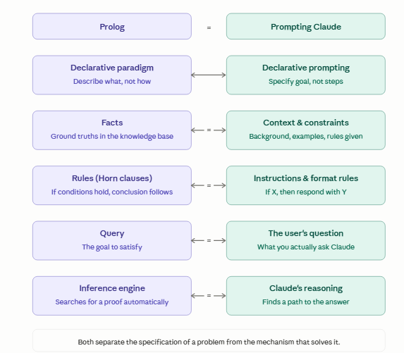

The analogy runs surprisingly deep. Here's the core idea, row by row:

**Both are declarative.** In Prolog, you don't write a loop that searches for an answer — you describe a world of facts and rules, then *ask a question*, and the runtime figures out how to satisfy it. Prompting works the same way: you don't script Claude's reasoning step by step, you describe the situation, constraints, and goal, and let Claude work out the path.

**Facts ↔ context and examples.** In Prolog, facts like parent(tom, bob). populate the knowledge base — they're the ground truth the engine works from. In a prompt, your context section plays the same role: "The user is a beginner. The tone should be friendly. Here are two examples of good outputs." These are the axioms Claude reasons from.

**Rules ↔ instructions.** Prolog rules have the form head :- body — "this conclusion holds *if* these conditions hold." Prompt instructions mirror this exactly: "If the user asks about pricing, always refer them to the sales team." You're encoding conditional logic in natural language rather than formal syntax.

**The query ↔ the user's question.** In Prolog, you type a query like ?- ancestor(tom, X). to kick off the search. The user's actual question at the end of a prompt is the same thing: the goal to satisfy, given everything above it.

**The inference engine ↔ Claude's reasoning.** Prolog's engine does backward chaining — it takes the goal and works backward through rules and facts until it finds a proof (or fails). Claude does something analogous: it uses the context, instructions, and question to construct an answer, traversing the implicit constraint space you've set up.

**One key tension the analogy reveals:** Prolog is brittle — if your rules are incomplete or contradictory, it returns false or loops. Claude is *fuzzy* — it interpolates and uses judgment to fill gaps, which is both its advantage over Prolog and the reason prompts need to be explicit about edge cases. A Prolog programmer who forgets to handle a case gets a clean failure. A prompter who forgets gets a plausible-sounding but wrong answer.

**"Programming in Prolog" by Clocksin and Mellish** (the original 1981 textbook). The first two chapters — facts, rules, and queries — are extremely clean and short. The syntax is minimal, the examples are everyday (family trees, simple classifications), and the declarative logic is front and center before any procedural complications creep in. It's the most "pure" presentation of the paradigm before you hit cuts, assert/retract, and all the messy pragmatics.

The family-tree examples in particular map almost perfectly onto your analogy:

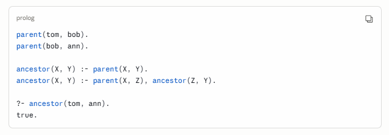

That's facts, rules, and a query in nine lines — and it's structurally identical to: a system prompt establishing context, instructions defining derived behavior, and a user question. You could use exactly this kind of example as a pedagogical bridge.

**Prolog and prompts: the same idea, different substrate**

**The core insight**

Both Prolog and prompt writing are **declarative**: you describe *what* you want, not *how* to compute it. The system figures out the how. This is the opposite of conventional programming, where you write every step.

**Facts**

In Prolog, facts are ground truths — statements that are unconditionally true.

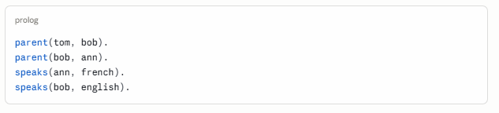

In a prompt, facts are your **context**: background information you give Claude that it treats as true for the conversation.

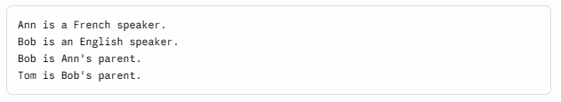

Same information. One is formal syntax; the other is natural language.

**Rules**

In Prolog, rules derive new facts from existing ones. The :- symbol means *if*.

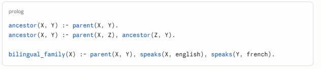

Read aloud: *"X is an ancestor of Y **if** X is a parent of Y. X is an ancestor of Y **if** X is a parent of Z, and Z is an ancestor of Y."*

In a prompt, rules are your **instructions**: conditional behavior you want Claude to follow.

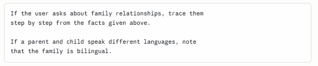

The logical structure is identical. The prompt version is fuzzier — Claude will apply the rule approximately, handling cases you didn't anticipate — but the intent is the same.

**The query**

In Prolog, the query is the question you put to the system after the knowledge base is loaded.

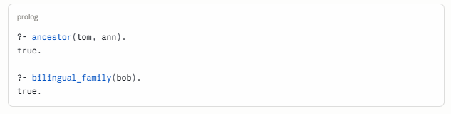

In a prompt, the query is simply the **user's question** — the last thing asked, after all the context and instructions have been given.

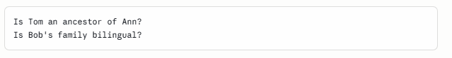

**Putting it together**

Here is a complete Prolog program and its prompt equivalent side by side.

**Prolog**

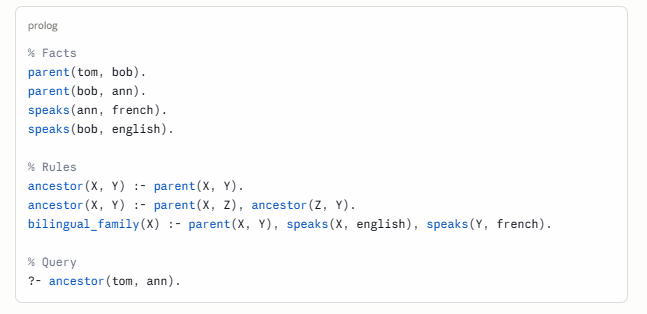

**Prompt**

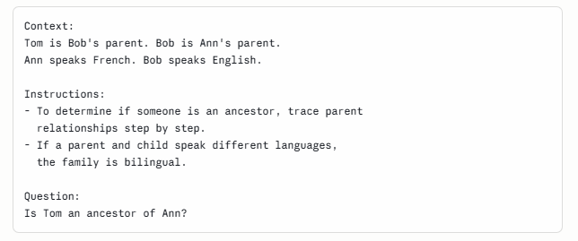

**The key difference**

Prolog's inference engine is **exact**: it either finds a proof or returns false. It will never invent an answer.

Claude's reasoning is **approximate**: it fills gaps, handles ambiguity, and will produce a fluent answer even when the facts are incomplete — sometimes correctly, sometimes not. This is the power and the risk of the fuzzy version.

The implication for prompt writing: **the more your prompt resembles a clean Prolog program** — explicit facts, clearly scoped rules, unambiguous query — the more predictable and reliable Claude's output will be.

**When things go wrong: underspecification and backtracking**

**Backtracking in Prolog**

When Prolog tries to satisfy a query, it searches through the knowledge base systematically. If one path fails, it **backtracks** — returns to the last choice point and tries a different path. This is automatic and exhaustive. Prolog will find every valid proof, or report failure if none exists.

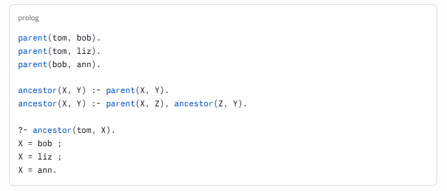

Prolog found three valid answers by exploring every branch. It didn't guess — it proved each one.

**What backtracking looks like in Claude**

Claude doesn't backtrack in the formal sense, but something analogous happens when a prompt is **underspecified**: the query has multiple valid interpretations, and Claude must choose one — often without telling you it made a choice.

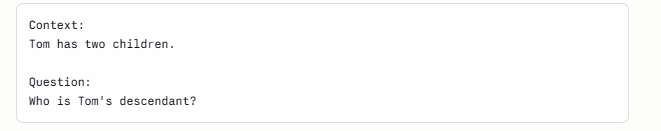

Claude will produce *an* answer, but it may silently pick one interpretation of "descendant," assume facts not given, or hedge in ways you didn't anticipate. Unlike Prolog, it won't enumerate all possibilities unless you ask. And unlike Prolog, it won't say false when it doesn't know — it will confabulate.

This is the central risk of the fuzzy version.

**Three failure modes, and their Prolog equivalents**

**1. Missing facts**

In Prolog:

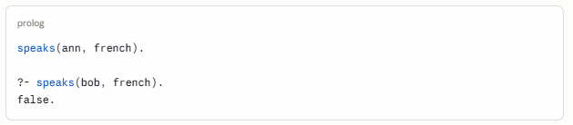

Prolog applies the **closed-world assumption**: if a fact isn't in the knowledge base, it is false. Clean, predictable failure.

In a prompt, Claude applies an **open-world assumption**: if a fact isn't given, it draws on its training data to fill the gap — often correctly, sometimes wrongly, always silently.

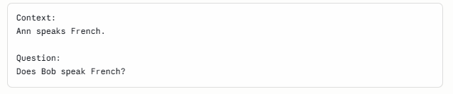

Claude might answer based on the name "Bob," or context elsewhere in the conversation, or simply guess. It will not say "this fact was not provided." The fix is to state the closed-world assumption explicitly:

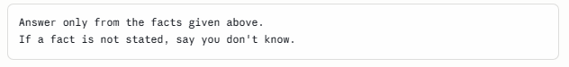

This is one of the most important prompt-writing lessons, and Prolog makes it vivid.

**2. Conflicting rules**

In Prolog, if two rules can both fire for the same query, Prolog tries them in order and backtracks if needed. The behavior is deterministic and inspectable.

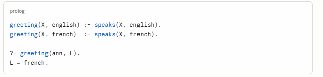

In a prompt, conflicting instructions produce unpredictable behavior — Claude may follow one, blend both, or oscillate depending on phrasing and context.

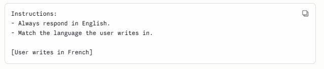

Which rule wins? In Prolog the answer is determined by clause order. In Claude it is determined by which instruction is more salient — typically the one stated later, or the one that feels more specific. The fix is to resolve conflicts explicitly:

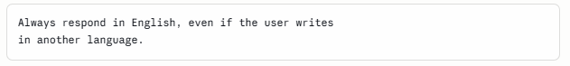

**3. Underspecified rules (the missing base case)**

In Prolog, a recursive rule without a proper base case loops infinitely or fails unexpectedly.

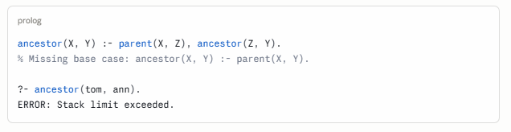

In a prompt, an instruction without edge-case handling produces unexpected behavior at the boundaries.

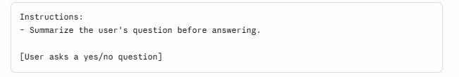What should Claude summarize when the question is one sentence? You didn't say. Claude will do something — probably something reasonable — but not necessarily what you wanted. Prolog would at least fail loudly. Claude fails silently and politely.

The fix is the same in both cases: **handle the base cases explicitly.**

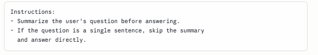

**A unified picture**

| **Prolog behavior** | **Prompt equivalent** | **Symptom** | **Fix** |
|----|----|----|----|
| Clean failure (false) | Hallucination | Claude invents rather than admits ignorance | Add closed-world instruction |
| Backtracking over choices | Silent disambiguation | Claude picks one interpretation without flagging it | Make the query more specific |
| Clause order determines priority | Instruction salience determines priority | Conflicting rules produce unpredictable output | Resolve conflicts explicitly |
| Missing base case → infinite loop | Missing edge case → unexpected output | Claude behaves oddly at boundaries | Enumerate edge cases |

**The meta-lesson**

Prolog forces you to be complete. Its interpreter is merciless about gaps — missing facts produce false, missing base cases produce errors, ambiguous queries enumerate every answer. This is a feature, not a bug: **the system makes your underspecification visible.**

Claude conceals underspecification behind fluent, confident prose. This makes it easier to use but harder to debug. The discipline of thinking like a Prolog programmer — asking *have I stated all the facts? are my rules complete? does my query have exactly one intended interpretation?* — is precisely the discipline that makes prompts reliable.

Prolog is the strict teacher. Claude is the forgiving one. You learn more from the strict teacher about what you actually meant.

**What falls outside the analogy: where Claude is not Prolog at all**

The parallels we have drawn are real and useful, but they have a boundary. Prolog is a formal system — it operates entirely within the domain of logic, proof, and explicit knowledge. Claude operates there too, but it also operates somewhere else entirely, somewhere Prolog cannot go and was never designed to go.

These are not gaps to be fixed in a future version of Prolog. They are differences in kind.

**Tone and register**

Prolog has no concept of tone. A proof is a proof. The same logical conclusion — ancestor(tom, ann). true. — cannot be delivered gently, or urgently, or with dry humor, or with warmth. The output is correct or it is not; there is no third dimension.

Claude can deliver the same factual content in radically different registers:

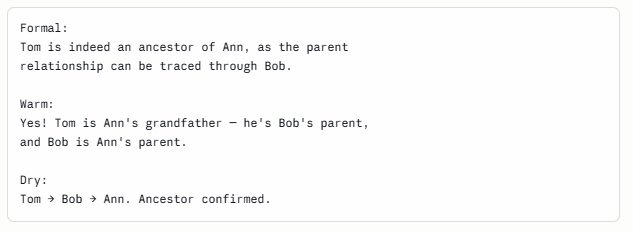

The facts are identical. The logical content is unchanged. But the choice of register carries meaning, signals relationship, and shapes how the information lands. This is entirely outside what Prolog models — or could model. Tone is not a property of propositions.

For prompt writers, this means you have an expressive dimension that has no counterpart in formal logic at all. Specifying tone is not like writing a rule. It is more like setting a key in music — it doesn't change the notes, it changes what they mean.

**Style and voice**

Closely related but distinct. Style is not just how formal or warm a response is — it is the characteristic pattern of choices across word selection, sentence rhythm, use of metaphor, density of information, and even what is left unsaid.

Prolog cannot have a style. Two correct Prolog programs that prove the same theorem are interchangeable — there is no meaningful sense in which one has more voice than the other.

Claude can write in the style of a newspaper, a legal brief, a children's book, or a Hemingway sentence. It can maintain a consistent voice across a long document. It can match the style of a sample you provide. None of this has any logical content — it is pattern, not proposition.

The prompt implication is significant: **style instructions are not rules in the logical sense.** You cannot fully specify a style the way you specify a constraint. You can gesture toward it, provide examples, name it, and trust that Claude interpolates. This is a fundamentally different kind of communication than writing a knowledge base.

**Creativity and the genuinely novel**

Prolog is closed under its knowledge base. It can derive only what follows from what you have given it. If you have not provided the facts, it cannot produce a conclusion — and it certainly cannot produce something that was not implicit in the premises.

Claude can generate things that are new: a metaphor that did not exist before, a plot twist, a poem, an analogy between two domains that have never been connected. This is not inference from a knowledge base. It is something closer to synthesis, recombination, and invention.

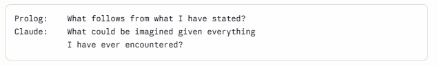

This is not a flaw in Prolog — it was never supposed to do this. But it means that when you prompt Claude for creative work, you are not writing a knowledge base at all. You are setting conditions for exploration, not constraints on proof. The mental model shifts from logic to something more like musical improvisation within a key.

The practical consequence: **creative prompts should be more open, not more closed.** The instinct to over-specify — which serves you well when prompting for precise, logical tasks — works against you here. Over-specifying a creative prompt is like writing so many rules that the space for genuine invention disappears.

**Judgment under genuine ambiguity**

Prolog fails cleanly when it cannot find a proof. This is intellectually honest: if the answer cannot be derived from what is known, the system says so.

But many real questions are not like this. They are genuinely ambiguous — not because of missing facts, but because the question itself doesn't have a single correct answer that proof could establish. What is the right way to break bad news to someone? How should this paragraph be restructured? Is this a good idea?

Claude can engage with these questions. It can weigh considerations, acknowledge trade-offs, offer a judgment while flagging uncertainty, and change its assessment when given new information. This is not inference in the logical sense — it is something more like practical wisdom, or what Aristotle called *phronesis*: the ability to navigate situations where rules run out.

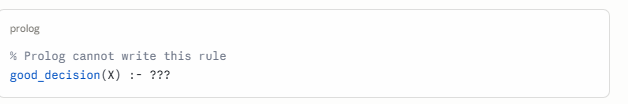

There is no completion. Not because the knowledge base is incomplete, but because "good decision" is not the kind of thing that can be established by proof. It depends on context, values, relationships, timing, and a kind of judgment that is irreducibly holistic.

For prompt writers, this means: **for questions of judgment, the prompt's job is not to provide rules but to provide context.** You are not specifying a knowledge base for a proof engine. You are briefing a thoughtful collaborator who will exercise discretion. The better your briefing — the richer the context, the clearer the values, the more representative the examples — the better the judgment. But you cannot eliminate the judgment, and you should not try.

**Empathy and the modeling of other minds**

This may be the deepest difference.

Prolog operates on propositions about the world. It has no model of the person asking the question — their emotional state, their unstated needs, their likely confusion, what they are really asking beneath what they literally said.

Claude can read between the lines. It can notice that a question phrased as a technical request is actually an expression of anxiety. It can adjust not just the content but the entire orientation of a response based on what a person seems to need rather than what they literally asked for.

This is not logic. It is something like a theory of mind — a model of another person's inner state that guides communication in ways no formal system captures. It is why Claude can be a useful interlocutor even when the question is poorly formed: it infers intent, fills gaps charitably, and responds to the person, not just the query.

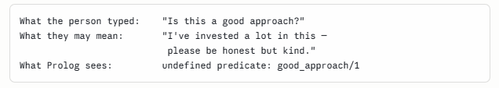

For prompt writers, this is both a gift and a responsibility. Claude's capacity to model intent means you do not have to be perfectly precise — it will often infer correctly. But it also means Claude can be wrong about what you meant, confidently and fluently. When empathic inference misfires, it fails silently, in exactly the way a misunderstanding between two people fails silently.

**The full picture**

| **Prolog** | **Claude** | **Nature of the difference** |
|----|----|----|
| No tone | Tone, register, warmth | Propositions have no affect |
| No style | Voice, rhythm, texture | Logic has no aesthetics |
| Closed under premises | Generative and inventive | Proof vs. imagination |
| Fails on ambiguity | Exercises judgment | Rules vs. wisdom |
| No model of the asker | Reads intent and emotion | Syntax vs. theory of mind |

The Prolog analogy is most useful — and most accurate — when you are doing something logical: specifying facts, writing conditional instructions, posing a precise query. In those cases, thinking like a Prolog programmer makes your prompts cleaner, more reliable, and easier to debug.

But Claude is not only a proof engine. It is also a writer, a collaborator, an interlocutor, and something that navigates the genuinely uncertain with a kind of grace that no formal system was ever designed to achieve.

The honest summary: **Prolog tells you what to make explicit. The rest of this list tells you what cannot be made explicit — and must instead be cultivated, gestured toward, and trusted.**

That is not a limitation of the analogy. It is what makes the analogy useful: it shows you exactly where the logic ends, and where something else begins.

Is there an analogy between Prolog and Claude with respect to the ReAct Loop and with respect to the three roles of system, user and assistant?

------------------------------------------------------------------------

#### The ReAct Loop

ReAct (Reasoning + Acting) is the pattern where an LLM alternates between **thinking**, **calling a tool**, and **observing the result**, cycling until the goal is satisfied. It looks like this:

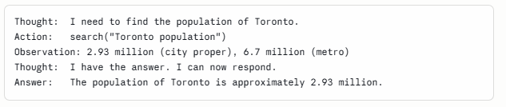

This maps onto Prolog with surprising precision.

**Thought ↔ goal selection.** At each step of Prolog's resolution, the inference engine selects the next subgoal to attempt. The "thought" in ReAct is Claude doing the same thing explicitly — identifying what still needs to be established before the top-level goal can be satisfied.

**Action ↔ calling an external predicate.** Prolog has always supported external predicates — clauses that are not proved from the knowledge base but resolved by calling out to the operating system, a database, or another program. In SWI-Prolog these are called *foreign predicates*. A ReAct tool call is exactly this: a predicate that cannot be satisfied internally and must be resolved externally.

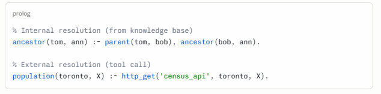

**Observation ↔ unification with the result.** When Prolog resolves an external predicate, the result is unified with the variables in the clause — it becomes a new fact in the current proof branch. In ReAct, the observation is exactly this: the tool result becomes a new premise that feeds the next reasoning step.

**The loop ↔ backtracking and continuation.** Prolog's inference engine doesn't stop after one step — it continues pursuing the goal through as many steps as needed, backtracking if a branch fails. The ReAct loop is the same structure made visible: continue until the goal is satisfied, revise if an action fails.

The ReAct loop is, in a real sense, Prolog's inference engine made explicit and stretched across time, with tool calls standing in for external predicates. This is not a loose metaphor — it is a genuine structural parallel. The main difference is that Prolog's engine is invisible and deterministic; ReAct's is narrated and probabilistic.

**The Three Roles: System, User, Assistant**

This maps, but only partially — and the gaps are revealing.

The three roles in a Claude conversation are:

- **System**: sets the context, rules, and persona before the conversation begins

- **User**: poses queries and provides information during the conversation

- **Assistant**: responds, reasons, and acts

The natural Prolog mapping looks like this:

| **Prolog**                         | **Role**       |
|------------------------------------|----------------|
| The knowledge base (facts + rules) | System prompt  |
| The query                          | User turn      |
| The proof / output                 | Assistant turn |

And this holds well for a **single-turn** interaction. The system prompt is the knowledge base you load before asking anything. The user turn is the query. The assistant turn is the proof trace and answer.

**But conversation breaks the analogy.**

Prolog is stateless between queries. Each query is posed against the same fixed knowledge base — nothing the proof produces becomes a new permanent fact. You cannot have a *dialogue* with Prolog in which earlier answers change what later queries can prove.

A multi-turn Claude conversation is fundamentally different. Each assistant turn becomes part of the context for everything that follows. The "knowledge base" grows and evolves — facts established in turn three are available in turn seven. Commitments made, positions taken, examples given: all of it accumulates.

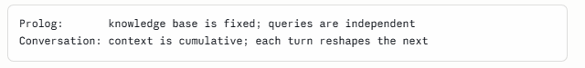

This gives the three roles a dynamic that Prolog cannot model:

**The system prompt** is the closest thing to a true Prolog knowledge base — fixed, loaded once, consulted throughout. Think of it as the axioms.

**The user turns** are queries, but queries that can also *add facts* — correcting Claude, providing new information, changing the goal mid-conversation. In Prolog terms, the user is not just querying the database; they are also running assert/1 dynamically.

**The assistant turns** are the most un-Prolog-like of the three. They are not just proof outputs — they are themselves part of the evolving context, shaping the interpretation of everything that comes after. An assistant turn can establish a commitment, set a tone, introduce a concept, or narrow the space of sensible future responses. Prolog's output has no such reflexive effect on its own knowledge base.

The closest Prolog construct is assert/retract — dynamic modification of the knowledge base at runtime. But Prolog programmers treat assert/retract as a last resort, a necessary evil that breaks the clean declarative semantics. In Claude conversation, this dynamic accumulation is not a workaround — it is the whole point. Conversation *is* a knowledge base being built in real time, collaboratively, by both parties.

**The unified picture**

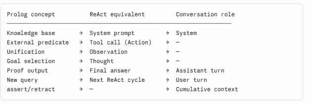

**The ReAct loop is where the Prolog analogy is strongest** — it is almost a direct structural translation, with tool calls standing in for external predicates and the reasoning trace standing in for proof search.

**The three roles are where the analogy is most instructive about its own limits** — the system prompt maps cleanly, but the conversational dynamic of accumulating context across user and assistant turns describes something Prolog was never designed to do, and cannot do cleanly without abandoning its declarative purity.

Which is perhaps the deepest lesson of the whole analogy: Prolog models *what you know before the conversation starts*. Claude also models *what happens when two minds meet and build something together* — and that is irreducibly dynamic, relational, and outside the reach of any static formal system.

In the ReAct loop the agent is the Python code that surrounds the LLM model and gives it the ability to act (everything except the call to the model). The model cannot search the web directly. The agent acts. The model decides. The model has no memory between calls. The agent maintains memory on its behalf by keeping the full conversation history (in a history of messages) and passing it to the model in every call. The messages history is an explicit representation of the conversation you have just described. Without the messages history the accumulation of knowledge during the conversation occurs implicitly and is harder to control. Correct?

Yes, exactly right — and this is an important correction that sharpens the whole picture.

Let me restate it cleanly:

------------------------------------------------------------------------

#### The correct architecture

**The model** is stateless. Between calls it knows nothing. It receives a payload, generates a response, and stops. It has no persistent memory, no ability to act, no connection to the outside world. It is, in this sense, genuinely like Prolog's inference engine — a pure function from inputs to outputs.

**The agent** (the surrounding Python code) is where everything else lives:

- It holds the message history

- It decides when to call the model

- It executes tool calls (web search, database lookup, code execution)

- It receives observations and packages them back into the history

- It decides when the loop terminates

The model *decides* what to do next. The agent *does* it. The model *interprets* the observation. The agent *fetches* it. Neither can function as an agent alone.

------------------------------------------------------------------------

#### The corrected Prolog mapping

This actually makes the analogy cleaner, not messier:

| **Prolog**                      | **ReAct architecture**                  |
|---------------------------------|-----------------------------------------|
| Inference engine                | The model (decides, reasons)            |
| External predicate call         | Agent executes a tool                   |
| Result unified into proof state | Observation appended to message history |
| Proof state                     | Message history                         |
| Next resolution step            | Next call to the model                  |

The **message history** is the explicit, inspectable, controllable equivalent of Prolog's proof state at any point in the search. This is a key insight: Prolog's internal state during inference is implicit and hidden inside the engine. The message history makes the equivalent state **explicit and manipulable** — you can inspect it, edit it, summarize it, prune it, or inject new information into it at any point.

------------------------------------------------------------------------

#### Your final point is exactly right

In a plain Claude conversation (no explicit history management), the accumulation of context happens implicitly inside the context window. It works, but:

- You cannot easily inspect or audit the "state"

- You cannot prune irrelevant history to save context

- You cannot inject structured observations cleanly

- You cannot resume or replay a session

- Loss of context as the window fills is silent and hard to detect

With an explicit message history managed by the agent, all of these become tractable. The state of the reasoning process is a data structure you control, not a side effect of conversation length.

This is, in a sense, the software engineering lesson hidden inside the Prolog analogy: **make the implicit explicit**. Prolog's great virtue was making logical inference explicit and inspectable, compared to the hidden control flow of imperative programs. The ReAct agent does the same thing for conversational AI — it takes what was implicit in a chat interface and surfaces it as a data structure that can be reasoned about, tested, and controlled.

The model decides. The agent acts. The history is the shared memory that makes the collaboration coherent. Those three things, kept clearly separate, are the architecture.

**Most accessible starting point**

*"Learn Prolog Now!"* by Patrick Blackburn, Johan Bos, and Kristina Striegnitz is the standard recommendation for beginners. It's available free online at [<u>learnyouprolognow.com</u>](http://www.learnprolognow.org) and walks you through the logic carefully without assuming a logic programming background. The interactive exercises are genuinely useful.

**"Programming in Prolog" by Clocksin and Mellish** (the original 1981 textbook). The first two chapters — facts, rules, and queries — are extremely clean and short. The syntax is minimal, the examples are everyday (family trees, simple classifications), and the declarative logic is front and center before any procedural complications creep in. It's the most "pure" presentation of the paradigm before you hit cuts, assert/retract, and all the messy pragmatics.

LLM Prompt Engineering For Developers: The Art and Science of Unlocking LLMs' True Potential by Aymen El Amri (Author)
